# Skill: ASW CaaS Lead 2.0 — Monthly Business Insight Dashboard

## Metadata

| Field | Value |
|---|---|
| **name** | `asw_caas_lead` |
| **version** | 3.0.1 |
| **author** | Jacob Wang (jacobw@microsoft.com) |
| **category** | analysis · reporting |
| **icon** | PeopleTeam |
| **output language** | All deliverables (dashboard, tables, insight narrative) in **English**; conversational replies follow user language |
| **deliverable** | `Output/caas_lead_monthly_FY<YY>.html` (self-contained HTML) |
| **primary script** | `Skills/asw_caas_lead/scripts/generate_dashboard_v1.py` |

---

## 1 · Program Context

The **CaaS Lead 2.0** program (owned by ASW, kicked off Jul FY25, refocused Dec FY26) transitions SAP-on-Azure and Epic-on-Azure workload support from a reactive incident model to a **proactive, insight-driven KnowMe experience** for a curated list of high-value customers.

**Program leadership**
- **Sponsor**: Steve Pogge (CSS ASW WW Lead)
- **Program Owners**: Kirk Beller & Jacob Wang (Zone 2 / Zone 1)
- **PM**: Tiago Simões

**FY27 rollup name (canonical)**
> Program- CaaS Lead 2.0 Rollup (Mission Critical, Potential MC & RISE Selected)

This is the sheet name in `ASWCustomerOutreach_TargetCustomer_KPIs.xlsx` — sheet `FY27 Customer Outreach KPIs`. It covers three overlapping segments:

1. **Mission Critical** — customers with a live MC-for-SAP / MC-for-Epic contract.
2. **Potential MC** — high-volume customers in the MC pipeline.
3. **RISE Selected** — SAP RISE customers newly requested by the CSI team (currently GM & CVS).

**This skill's role** — assemble a **monthly-refreshed Business Insight Dashboard** that answers, per focus customer and per cohort:
- Are reactive support fundamentals healthy? (Panel A · Support Delivery)
- Is the CaaS Lead investment producing outreach outcomes? (Panel B · Program Indicators)
- Where should the Zone Lead / PM redirect attention next month? (Cards · colour-coding · Next Actions callout)

---

## 2 · When to Use / Not Use

**Trigger this skill when**
- "Refresh the CaaS Lead dashboard" / "Build the Monthly Business Insight"
- "Update the FY27 Customer Outreach KPIs"
- "Show me support delivery this month for the focus customers"
- "Which focus customers are trending down on DTC / %<7 / CSAT / IR / escalations?"
- "List the top SapSupportPathL2 / L3 topics for our focus customers"
- "Case Leakage % for Wave 1 / Wave 2 subscription-based routing customers"
- "Draft the monthly Outreach status for Kirk / Steve / Tiago"

**Do NOT use for**
- **Monthly Review Meeting** (whole-ASW KPI report) → [`review-reporter`](../review-reporter/SKILL.md)
- **Customer Change Event Support Summary** (drills / go-lives / cutovers, 90-day rollup) → [`asw_change_support_summary`](../asw_change_support_summary/SKILL.md)
- **General KQL authoring / ad-hoc case query** → [`kusto_query`](../kusto_query/SKILL.md)
- **CaaS Award Nomination writing** → [`award_writer`](../award_writer/SKILL.md)
- **Weekly Musketeers Top-15 action list** → [`asw_musketeers_mission`](../asw_musketeers_mission/SKILL.md)

---

## 3 · Program in One Diagram

```mermaid
flowchart LR
  subgraph Focus[FY27 Focus Customer Rollup - 27 customers]
    R[SAP RISE / MC / MC Pipeline<br/>SAP RISE tenant · PepsiCo · Woolworths<br/>Medline · Shell · Ferrero · Lego · Beiersdorf · Walgreens]
    N[SAP Native - MC / Potential MC<br/>Nike · Bayer · BHP · Unilever<br/>McKesson · Halliburton · Petrobras]
    E[EPIC - Mission Critical<br/>Mt. Sinai · TJU · MichMed · Univ. Kentucky<br/>Ascension · UTMB · Brown · Cone · CHOP]
    S[SAP RISE Selected<br/>General Motors · CVS]
  end

  Focus --> CL[CaaS Lead<br/>Primary + Secondary]
  CL --> D[Deliverables]

  subgraph D[CaaS Lead 2.0 Deliverables]
    D1[PoR - Plan of Record]
    D2[Wiki - KnowMe Page]
    D3[Grafana Cx Dashboard]
    D4[Subs / Tag routing]
    D5[Case Analysis and Insight]
    D6[+AI - Zebra AI]
  end

  D --> Dash[Monthly Business Insight Dashboard<br/>THIS SKILL]
  Dash --> Lead[Zone Leads + PM<br/>Kirk · Jacob · Tiago]
  Lead --> Focus
```



**Engagement Stages** (KPI xlsx column `Stage`):

| Stage | Meaning | Card border colour |
|---|---|---|
| Phase 1 | Onboarding / gathering info | red |
| Phase 2 | Foundational assets built (Subs · Tag · Dashboard) | amber |
| Phase 3 | PoR + Wiki delivered, stakeholder cadence live | blue |
| Phase 4 | Case Analysis & Insight active + AI leveraged | green |

---

## 4 · Dashboard Structure (5 Sections)

### Section 1 · Program-Wide Rollup (9 cards)

A 3×3 KPI-card grid covering the entire focus roster.

| # | Card | Definition | Source | Status |
|---|---|---|---|---|
| 1 | **Focus Customers** | Count of customers in the FY27 rollup | This skill's `FOCUS` list | ✅ |
| 2 | **FY26 Total Case Create Volume** | Sum of cases created in FY26 across all focus TPIDs | Kusto → `Output/asw_fy26_all_cases.json` | ✅ |
| 3 | **FY26 Total Case Close Volume** | Cases with `ClosedDateTime` populated in FY26 | Same as #2 | ✅ |
| 4 | **FY26 Avg CPE** | Cases-Per-Engineer (avg cases handled per ASW engineer) | ⏳ Needs per-queue engineer roster join | **NA** |
| 5 | **FY26 IR Met %** | % cases meeting Initial Response SLA | ⏳ CSS A&I / DTP Power BI per-TPID | **NA** |
| 6 | **FY26 Total Case Avg DTC** | Avg Day-to-Close for cases closed in FY26 | Kusto (from #2 dataset) | ✅ |
| 7 | **FY26 % Case Close < 7d** | % of closed cases with DTC < 7 days | Same as #6 | ✅ |
| 8 | **FY26 Collaborate Case Creation** | Cases opened via Collaborate flow | ⏳ Needs collaborate-created flag in case schema | **NA** |
| 9 | **FY26 Change Event Support** | Count of customer change events supported | KPI xlsx `# Change Events` (manual entry) | ✅ |

### Sections 2 – 5 · Cohort Sections

Each cohort section renders in this order:

1. **Mini-rollup strip** (8 small cards, v2.2.0; **+1 ACR Sum card in Section 2 only**, v2.3.0): Customers · Case Volume · **Avg CSAT** · Avg DTC · %<7d · **CritSit Rate (%)** · **Case Insight Deliver** (X/N) · **Story / Event Support / Exec Escalation** totals · (Section 2) **ACR Sum** (pending). Each target-based card has an LED (see §4.5).
2. **Customer summary cards** — one per customer, colour-coded by Engagement Phase, showing Case Vol / Closed / **CritSit %** (with `n=<count>` suffix, v2.3.0) / Avg DTC / %<7d / CSAT / #Story / #Event Support / #Exec Escalation (+ **ACR** placeholder in Section 2, v2.3.0). LEDs sit inline next to the three target-based KPIs (Avg DTC, %<7d, CSAT). Bottom tags: **Insight Deliver** ✓/⚠, **Wiki** ✓/⚠ (v2.2.0 dropped the standalone `AI` tag from the card face; still tracked in detail table). **Card order = Case Volume descending** within each section (v2.3.0, tiebreaker = customer name asc).
3. **Detail table** (Sections 3 · 4 · 5) — Panel A (10 columns) + Panel B (6 columns) + MC Contract + ACR.

| Section | Cohort | Members (FY27) | With detail table? |
|---|---|---|---|
| 2 | **SAP RISE + SAP Native with Mission Critical** | SAP RISE (tenant) · PepsiCo · Woolworths · Medline · Shell · Ferrero · Lego · Beiersdorf (**8**) — Walgreens removed in v2.2.0 (MC Pipeline, not signed) | ✅ (v2.6.0) |
| 3 | **EPIC — Mission Critical** (v2.3.0 swap: was Section 4) | TJU · MichMed · Univ. Kentucky · Ascension · UTMB · Brown · Cone Health · CHOP (**8**) — Mt. Sinai moved out (no MC) | ✅ |
| 4 | **SAP Native/Epic Potential MC** (v2.3.0 rename + reorg: was Section 3) | Nike · Bayer AG · BHP · Unilever · McKesson · Halliburton · Petrobras · **Mt. Sinai** (EPIC, non-MC) · **Walgreens** (RISE, MC Pipeline) (**9**) | ✅ |
| 5 | **SAP RISE Selected** | General Motors · CVS (2) | ✅ |

> **Cohort tabs (v2.6.0)**. All four cohort sections (2, 3, 4, 5) render as **four tabs** immediately after the Legend — main page keeps only Baseline strip + Program Rollup + Legend + Tabs. Tab bar order left→right: `R → E → N → S`. Last-picked tab is remembered in `sessionStorage` (`caas-active-tab`). Section S (SAP RISE Selected — GM & CVS, 2 customers, pre-onboarding, no case data yet) is included as a tab for consistency — it still renders the mini-rollup + cards + empty detail table, so reviewers can drill in when data arrives.

### 4.5 · Dashboard UX Conventions (v2.2.0 — LEDs, symbols, labels)

#### 4.5.1 · LED status system

Every KPI card (Section 1 rollup, ASW Baseline strip, cohort mini-rollup, per-customer target-based metrics) carries an LED dot in the top-right:

| LED | Rule | Use |
|:-:|---|---|
| 🟢 Green | value **meets or beats** target | KPI at/above goal |
| 🟡 Yellow | value trails target by **≤ 3%** (relative) | slight miss — watch |
| 🔴 Red | value trails target by **> 3%** (relative) | actionable miss |
| 🔵 Blue | **informational** — no target, or pending data | Case Volume, CritSit Rate, Customers, Story/Event/Esc combo |

Implemented via `status_led(value, target, higher_is_better=True|False)` in `generate_dashboard_v1.py`. The relative gap is `(target − value)/target * 100` (or reversed for lower-is-better). Constant `LED_BLUE` for informational.

#### 4.5.2 · Target-based KPIs (LED-coloured)

| KPI | Target | Direction |
|---|---|---|
| Avg DTC | ≤ 12 days | lower better |
| % Case Close < 7d | ≥ 50% | higher better |
| Avg CSAT | ≥ 4.80 | higher better |
| Case Insight Deliver | 100% coverage of focus customers | higher better |
| Executive Escalation | 0 | lower better (Section 1 only; on cohort strip currently shown as info) |

Informational (blue) cards: Total Case Vol, Closed, Distinct Customers, CritSit Rate, CaaS Lead Coverage, Story / Event Support / Exec Escalation combo.

#### 4.5.3 · Customer-card bottom tags (v2.2.0)

Only two program-indicator tags render on the card face; **AI is no longer shown as a card tag** (still in detail table):

| Tag | Symbol on card |
|---|:-:|
| **Insight Deliver** (was `CA`) | ✅ green ✓ = delivered · ⚠ yellow triangle = not yet started |
| **Wiki** (KnowMe Wiki + PoR maintained ≤ 90d) | same |

Implemented via `fmt_status(v)` helper (green `.status-ok` / yellow `.status-warn`).

#### 4.5.4 · Canonical card / metric labels (v2.2.0)

| Location | Old label | **New canonical label** |
|---|---|---|
| Cohort summary card | Case Analysis | **Case Insight Deliver** |
| Cohort summary card | Success / Change / Esc | **Story / Event Support / Exec Escalation** |
| Cohort summary card | Engineers | **removed** |
| Cohort summary card | CritSit (count) | **CritSit Rate (%)** = section CritSit / section Case Volume |
| Cohort summary card (Section 2 only, v2.3.0) | — | **ACR Sum** (blue LED, value = `pending`) |
| Customer card metric | #Success · #Change · #Exec Esc | **#Story · #Event Support · #Exec Escalation** |
| Customer card metric (v2.3.0) | CritSit (count) | **CritSit %** with `n=<count>` suffix (same style as CSAT `n=`) |
| Customer card metric (Section 2 only, v2.3.0) | — | **ACR** (blue LED, value = `pending`) |
| Customer card tag | CA | **Insight Deliver** |
| Customer card tag | AI | **removed from card face** |
| MC contract pill | Yes / Yes (Renew) / Yes (New MC) / Yes (MSaaS RISE) | **Mission Critical** · **Mission Critical (Renew)** |

**MC-active detection helper** (`_is_mc_active(mc)`) recognises both legacy `Yes*` prefixes and canonical `Mission Critical*` prefix; excludes `Pipeline` / `Non-SFMC` / `exiting`. Do NOT break this helper when adding new MC label variants — downstream: Section 1 Card 2 count, `mc_by_sect`, and cohort `sub_mc`.

#### 4.5.5 · Section ordering · what got removed · card sort

- **Section 1a · Manager Rollup** — removed in v2.2.0 (template line dropped; `render_manager_rollup` function kept but unused, restore by adding `{manager_rollup_html}` back to template).
- **ASW FY26 Baseline & CaaS Lead Coverage** strip (8 cards) sits **above** Section 1 as denominator context: Total Vol · Closed · **ASW Total Avg CSAT** · Avg DTC · %<7d · CritSit Rate · Distinct Customers · CaaS Lead Coverage. Powered by `render_asw_baseline()` + `csat_asw_total()`.
- **Section render order (v2.3.0)**: `R → E → N → S` — EPIC (Section 3) now sits between SAP MC (Section 2) and SAP Native/Epic Potential MC (Section 4). Controlled by the tuple in the render loop: `(("R", False), ("E", True), ("N", True), ("S", True))`.
- **Customer card sort (v2.3.0)**: within each section, cards are sorted by **Case Volume descending** (tiebreaker = customer name ascending). Implemented in `render_section()` via `sorted(zip(customers, pas, css), key=lambda t: (-(t[1]['vol'] or 0), t[0]['customer'].lower()))`. The `FOCUS` list order is no longer meaningful for card display; use it only for stable data-authoring.

#### 4.5.6 · Section 1 title (v2.2.0)

**Section 1 · CaaS Lead 2.0 Rollup (Focus Customers)** — was previously "Program-Wide Rollup". Contains 11 LED-decorated cards including MC breakdown (SAP RISE / SAP Native / Epic) in Card 2 sub-text, and Card 10 = **Change Events** with drill-down populated from the FY26 xlsx (see §4.6).

### 4.6 · FY26 Change Events — authoritative xlsx source (v2.2.0)

**Ground truth**: `Skills/asw_caas_lead/references/fy26_asw_cx_changing_activities.xlsx` (mirror of the SharePoint `FY26_ASW_Cx_Changing_Activities_Annual_Results_2026-06-30.xlsx`, sheet `Summary by Customer`). Local text extract: `Skills/asw_caas_lead/references/fy26_asw_cx_changing_activities.md`. Totals JSON for Section 1 Card 10: `Skills/asw_caas_lead/references/fy26_change_events.json`.

**FY26 authoritative counts** (10 customers, 29 total tracked = 28 completed + 1 cancelled):

| Customer (xlsx name) | # Events | Focus? |
|---|:-:|:-:|
| Woolworths | 5 | ✅ (Section 2) |
| BHP | 4 | ✅ (Section 3) |
| Procter & Gamble | 4 | ❌ (not in FOCUS) |
| Thomas Jefferson University | 4 | ✅ (Section 4) |
| Duke Healthcare | 3 | ❌ |
| Franciscan Alliance | 3 | ❌ |
| Ascension Health Alliance | 2 | ✅ (Section 4) |
| Emory University | 2 | ❌ |
| Ferrero | 1 | ✅ (Section 2) |
| Petrobras | 1 | ✅ (Section 3) |

FOCUS coverage = 18 / 29 = **62%**. Non-focus customers with change events (P&G, Duke, Franciscan, Emory) are flagged but **not** auto-added to FOCUS — the user (Jacob) reviewed and declined expansion 2026-07-18.

**Refresh procedure** when a new xlsx drops on SharePoint:
1. Download via Playwright (`?download=1` on the `:x:` share URL) or manual save, into `references/fy26_asw_cx_changing_activities.xlsx`.
2. Regenerate `.md` text via Excel COM: `powershell.exe -File Skills\asw_caas_lead\scripts\extract_office_text.ps1 -In ... -Out ...`.
3. Update per-customer `ce` values in `FOCUS` list from the `Summary by Customer` sheet.
4. Update `fy26_change_events.json` totals block.

### 4.7 · ACR (Azure Consumption) Collection Procedure (v2.14.0 — workload-scoping rule) — **SUPERSEDED by §4.7-A (v3.1.0, Kusto TTM)**

> ⚠️ **Superseded 2026-07-21**. This CX Observe / USD / MoM workflow is kept for reference only. All new monthly refreshes must use **§4.7-A (Kusto TTM)** below. Reason: CX Observe DOM/hover scraping proved fragile, Conditional Access blocks any non-external-Edge automation, and the monthly per-subscription table `CHUriEntityConsumptionBySubscription_PerMonthAndService` is access-denied. Kusto `WorkloadSearchSummarized.Consumption` (TTM ACU) is now the authoritative source.

**Source portal**: [CX Observe — Home](https://cxp.azure.com/cxobserve/home) (`cxp.azure.com/cxobserve/home`). Must be opened in **external Edge** with the user's corporate account signed in — no unattended API available today, this is a **manual monthly capture** flow.

**Unit**: **USD** (US dollars). The "Consumption" tile on the customer's CX Observe landing page shows *this month (till date)* value + a monthly trend chart (last 6 months) with amounts in USD. Capture the **latest complete month** value + the **previous month** value from the trend chart (hover each data-point → tooltip shows exact `Usage: $X.XXXXXXM` figure). MoM delta % is derived. Legacy JSON field names `acu_this_month` / `acu_display` / `prev_month` and helper `_fmt_acu()` are retained for loader compatibility; **their stored values are USD**, not ACU.

**🚨 MANDATORY SCOPING RULE (v2.14.0, per CaaS Lead direction)**:

> **ALL focus customers MUST be workload-scoped** (only the SAP RISE / SAP Native / Epic-related subscription's consumption is captured), **EXCEPT**:
>
> - **TPID `603819` (SAP SE)** — capture **org-level** consumption (the entire SAP SE Azure spend). This is the only intentional org-level entry and represents the aggregate SAP RISE program footprint on Azure.
>
> Every other TPID — including the other two SAP RISE tenant TPIDs `15902931` and `2699441` — must go through the `Related workloads → View` → pick the SAP / HANA / Epic workload row flow. Never record a non-603819 customer's org-level consumption number on their card.
>
> **Rationale**: Non-workload-scoped ACR overstates ASW's business scope by 5-20x for customers like PepsiCo / Walgreens / Nike where Azure spend spans many services outside SAP/Epic. The `workload` field on each `FOCUS` entry (`RISE` / `SAP` / `EPIC`) is the authoritative pointer to which workload row to pick.

**Per-customer steps** (repeat once per FOCUS entry):

| # | Step | Notes |
|---|---|---|
| 1 | Open external Edge → `https://cxp.azure.com/cxobserve/home` | Never Simple Browser |
| 2 | Type the customer TPID into **Customer Search** | Single-TPID |
| 3 | In the customer list, click the **TPID link** matching the input | Not the customer-name link |
| 4a | **ONLY TPID `603819` (SAP SE)** → the landing page's `Top KPIs / Insights at a glance` → `Consumption` tile is org-level. Capture directly. | Skip steps 5-6 |
| 4b | **All other customers (including SAP RISE TPIDs `15902931` and `2699441`)** → next to `Related workloads` click **View** | Opens the workload picker |
| 5 | In the `Customer` (workload) column find the correct workload row matching the FOCUS entry's `workload` field:<br>• **`workload="RISE"`** (GM, CVS, and the two secondary SAP RISE TPIDs) → row whose name contains `SAP RISE` or matches the tenant name<br>• **`workload="SAP"`** → row whose name contains `SAP`, `S/4`, `HANA`, `BW`, `NetWeaver`, etc.<br>• **`workload="EPIC"`** → row whose name contains `Epic` | Multiple workloads possible; pick the one whose scope aligns with the ASW support engagement. Note the chosen workload string in the JSON `workload` field for audit. |
| 6 | Click the workload row → page reloads with that workload's KPIs | Some tenants have no matching workload → record `"acu_this_month": null` and `"notes": "no matching workload in CX Observe"` |
| 7 | On the reloaded page, in `Top KPIs / Insights at a glance` → **Consumption** tile, hover the trend chart's **last complete month** data-point → capture `Usage: $X.XXXXXXM`. Then hover the **previous month** data-point → capture that value too. | Store both in the snapshot; loader derives `delta_pct`. |
| 8 | (Sanity check) The workload-scoped number should be **materially smaller** than the customer's org-level Consumption tile on the landing page (typically 2-20% for large enterprises). If your captured value equals the landing-page number, you likely grabbed the wrong scope — redo step 4b-6. | — |

**Storage contract** (proposed, ready for wiring in v2.4.0):

Add a new file `Skills/asw_caas_lead/references/fy26_acr_snapshot.json` with schema:

```json
{
  "snapshot_month": "2026-06",
  "prev_month": "2026-05",
  "captured_utc": "2026-07-18T00:00:00Z",
  "unit": "USD",
  "customers": [
    { "tpid": "636846", "customer": "PepsiCo",  "workload": "SAP",  "acu_this_month": 1452665, "acu_display": "1.45M", "prev_month": 1370265, "yoy_pct": null, "source_url": "https://cxp.azure.com/cxobserve/...", "notes": "" }
  ]
}
```

> **Field-name note**: `acu_this_month` / `acu_display` are legacy names (from the ACU-mislabel era). The stored numbers are **USD**. Do not rename — the loader and drill-dataset both depend on these keys.

Then in `generate_dashboard_v1.py`:
1. Load the JSON at startup; build a `TPID → acu_display` map.
2. Add `acr` display helper: pass to `render_customer_card()` alongside `pa` / `cs`.
3. In Section 2's mini-grid, replace the `pending` placeholder with the **sum of all Section 2 members' `acu_this_month`** formatted as `X.XXM USD`.
4. In each Section 2 customer card, replace the `pending` value with the customer's `acu_display`. LED can remain blue until an ACR target is agreed with Kirk/Steve.

**Manual capture cadence**: once per monthly refresh (Step 3 of `§8 · Monthly Refresh Workflow`), immediately after Panel B KPI xlsx refresh. Aim to complete Section 2's 8 customers first (that's where the dashboard already reserves display slots); expand to Sections 3/4/5 later once the storage schema is stable.

**Automation candidates** (future work, not blocking):
- Playwright script that iterates the FOCUS list, drives the CX Observe search box, screenshots the tooltip, and OCRs the value. Requires an authenticated Edge profile (interactive login the first run).
- CX Observe MCP / API access if / when Microsoft internally exposes one.

### 4.7-A · ACR Collection — **Kusto TTM Method** (v3.1.0, current — 2026-07-21)

> **This is the authoritative procedure for every monthly refresh from FY27 onwards.** Replaces the CX Observe DOM-scraping flow in §4.7.

**Source of truth**

| Field | Value |
|---|---|
| **Cluster** | `https://customerdomrptwus3prod.westus3.kusto.windows.net` |
| **Database** | `customerdomdata` |
| **Table** | `WorkloadSearchSummarized` |
| **Metric column** | `Consumption` — **TTM ACU** (Trailing Twelve Months, Azure Consumption Units) |
| **Access** | Standard corporate identity — no elevated role required. Use the `mcp_fabric-rti-mc_kusto_query` MCP tool directly (no `az login`, no `kusto_runner.py`). |
| **Refresh cadence** | Underlying table refreshes weekly. Each captured value is a rolling 12-month window ending on the capture date. |

**Metric switch: monthly → TTM (Trailing Twelve Months)**

CX Observe's "Consumption" tile showed *last full month* + *previous month* + MoM %. Kusto `WorkloadSearchSummarized.Consumption` instead shows **TTM ACU** — a rolling 12-month sum per workload. The dashboard now:

- Renames card labels: `Azure Consumption Units` → **`Azure Consumption (TTM)`**
- Renames Card 11 / section cards: `FY26 Jun Sum` → **`Azure Consumption (TTM)`**
- Adds footnote / tooltip: **`TTM = Trailing Twelve Months`** on every card carrying an ACR value
- **Suppresses the MoM arrow** whenever `prev_month` is null (i.e. always in the current single-snapshot flow) — the trend triangle rendering already handles this branch (`acr_trend_html(None)` returns empty string)
- Values are **ACU** (Azure Consumption Units), not USD. The legacy field names `acu_this_month` / `acu_display` are retained for loader compatibility — they now store TTM ACU integers.

**Scope rule** (unchanged in principle from §4.7, but implemented server-side)

Each FOCUS entry carries a `workload_hint` field (`RISE` / `SAP` / `EPIC`). The Kusto processor (`_fetch_acr_kusto.py`) filters `EntityName` by regex per hint:

| `workload_hint` | Regex on `EntityName` (word-boundary) | Behaviour |
|---|---|---|
| `RISE` | `sap` (case-insensitive) | Sums matching workloads |
| `SAP` | `(sap\|hana\|s/?4hana\|s/?4\|netweaver\|bw)` | Sums matching workloads |
| `EPIC` | `epic` | Sums matching workloads |

Two output fields per customer:
- `org_consumption_acu` — org-level Consumption (highest-consumption row for that TPID, typically the ACE/AED or S500 row)
- `hint_matched_consumption_acu` — **sum** of all workloads whose `EntityName` matches the hint's regex. **This is the value the dashboard uses.**

**Skipped customers** (return `null`, dashboard shows N/A)

| TPID | Customer | Reason |
|---|---|---|
| `636846` | PepsiCo | 11 workloads returned, none match `SAP` regex → hint-total = null. Pending CaaS Lead scope confirmation (which subscription counts as "SAP" for this account). |
| `523595` | Ferrero | 5 workloads returned, none match `SAP` regex → hint-total = null. Same as PepsiCo. |
| `2699441` | SAP RISE tenant 3 | Zero rows returned from the source table. Kept in roster for future re-attempts. |

All other 19 focus customers resolved. Program-level TTM sum: **5.58B ACU** as of 2026-07-20 (SAP SE alone accounts for 5.28B — 94% of the total, expected given RISE tenancy).

**The KQL query** (embedded in `_fetch_acr_kusto.py` as `KQL_QUERY_ALL_TPIDS`):

```kql
let TPIDs = dynamic([
  "603819","15902931","2699441","636846","1719071","682354","10545209",
  "523595","605015","1248703","640443","520706","523272","101552",
  "645076","643195","940486","1283152","639155","18982817","1833997","3841220"
]);
WorkloadSearchSummarized
| where TPIDS in (TPIDs)
| project EntityId, EntityName, EntityType, TPIDS,
          SubscriptionsCount, Consumption,
          IndustryName, VerticalName, RegionName
| order by TPIDS asc, Consumption desc
```

The list also includes the 5 EPIC customers whose TPIDs were resolved on 2026-07-21 (Univ. Kentucky `1733740`, UTMB `680928`, Brown University `1137436`, Cone Health `642914`, CHOP `2077544`) — see §4.7-A appendix / [`_fetch_acr_kusto.py`](scripts/_fetch_acr_kusto.py) `CUSTOMERS` roster for the authoritative list.

**Refresh commands** (run in the workspace venv, PowerShell):

```powershell
# 1. Execute the KQL via MCP → save raw JSON response
#    (done from Copilot chat; the MCP call itself is not a shell command)
#    → produces Skills/asw_caas_lead/references/acr_kusto_raw_all22.json

# 2. Process raw → rich per-workload snapshot + loader-compatible TTM snapshot
& .\.venv\Scripts\python.exe .\Skills\asw_caas_lead\scripts\_fetch_acr_kusto.py `
    --input .\Skills\asw_caas_lead\references\acr_kusto_raw_all22.json `
    --out .\Skills\asw_caas_lead\references\acr_kusto_snapshot.json `
    --out-loader .\Skills\asw_caas_lead\references\fy27_acr_snapshot.json `
    --scope hint_matched
# (Repeat with --out-loader fy26_acr_snapshot.json if you want FY26 to also switch to TTM.)

# 3. Regenerate dashboards
& .\.venv\Scripts\python.exe .\Skills\asw_caas_lead\scripts\generate_dashboard_v1.py --fy=fy27
& .\.venv\Scripts\python.exe .\Skills\asw_caas_lead\scripts\generate_dashboard_v1.py --fy=fy26
```

**Loader-compatible snapshot schema** (`fy27_acr_snapshot.json`, `fy26_acr_snapshot.json`)

```json
{
  "metric_type": "TTM",
  "metric_note": "TTM = Trailing Twelve Months",
  "snapshot_month": null,
  "prev_month": null,
  "captured_utc": "2026-07-20T16:32:04+00:00",
  "source": "Kusto: customerdomrptwus3prod.westus3.kusto.windows.net / customerdomdata / WorkloadSearchSummarized · Consumption (TTM)",
  "level": "hint_matched (per-customer aggregate across matching workloads)",
  "unit": "ACU (Azure Consumption Units, TTM)",
  "notes": "Values are Trailing Twelve Months (TTM) Azure Consumption Units per customer. ...",
  "customers": [
    {
      "tpid": "523272",
      "customer": "BHP",
      "alias": "BHP",
      "workload_hint": "SAP",
      "acu_this_month": 16548776,
      "prev_month": null,
      "delta_pct": null,
      "acu_display": "16.55M",
      "prev_display": null,
      "org_entity_name": "BHP (Azure ACE/AED)",
      "hint_matched_workloads": [ { "name": "...", "type": "...", "subs": 12, "consumption_acu": 16548776 } ]
    }
  ]
}
```

**Key downstream code changes** (already applied 2026-07-20):

| File | Change |
|---|---|
| `_fetch_acr_kusto.py` | Added `build_loader_snapshot(result, scope)` + `_fmt_acu_compact()`. Added `--out-loader` + `--scope` CLI flags. |
| `generate_dashboard_v1.py` — `load_acr_snapshot` | Extended `meta` keys to include `metric_type` + `metric_note`. |
| `generate_dashboard_v1.py` — Card 11 (Program) | Detects `metric_type == "TTM"` → renders label `Azure Consumption (TTM)` + sub-text `TTM = Trailing Twelve Months · <covered>/<total> covered · Kusto`. |
| `generate_dashboard_v1.py` — Section mini-grid | Same TTM-aware label + subtitle logic. |
| `generate_dashboard_v1.py` — Customer card metric | Label `Azure Consumption (TTM)`; hover tooltip = `TTM = Trailing Twelve Months`; value tooltip = `Trailing Twelve Months (TTM) · <display> ACU`. MoM arrow suppressed when `prev_month` null. |
| `generate_dashboard_v1.py` — drill modal `renderAcr` | When `prev_month == null && delta_pct == null`, renders TTM-only rows (Current TTM, Raw ACU, Metric = "Trailing Twelve Months · rolling 12-month sum"). Footer switches to Kusto source citation. |

**Backups** (do not delete)

- `Skills/asw_caas_lead/references/fy27_acr_snapshot_monthly.bak.json` — the last CX-Observe monthly snapshot before the TTM switch, keep for historical reference.
- `Skills/asw_caas_lead/references/fy26_acr_snapshot_monthly.bak.json` — same for FY26.

**Known limitations & pending work**

1. **No native MoM** — `WorkloadSearchSummarized` carries only the current TTM value, not a monthly time-series. To compute month-over-month TTM trend, we must **archive each monthly snapshot** and diff. **TODO (next session)**: build `Skills/asw_caas_lead/references/acr_ttm_history.json` — an append-only monthly archive keyed by `{captured_month: "2026-07", captured_utc, customers: [{tpid, ttm_acu}]}`. On each refresh, `_fetch_acr_kusto.py` should:
   - Append this month's TTM to the archive (or update if same month re-run)
   - Look up the *previous* month's TTM from the archive and populate `prev_month` / `delta_pct` in the loader snapshot
   - The existing dashboard MoM arrow / drill-modal already handle non-null `prev_month`, so this unblocks trend visualisation with **zero further code changes** to the generator.
2. **Missing SAP-hint match for PepsiCo & Ferrero** — needs CaaS Lead scope confirmation. If they don't have a SAP-tagged workload in the CustomerDomain data, we may need a manual override (e.g. hard-code an `EntityId` per customer in `_fetch_acr_kusto.py`).
3. **SAP RISE tenant 3 (`2699441`) returns zero rows** — probably out-of-scope of this table or under a different TPID. Re-check next quarter.
4. **`ACR_Prod_Staging` table trails by ~12 months** — the per-TPID monthly ACR table (`AzureConsumedRevenue` in USD) is 12mo behind. Not a viable source for near-current MoM.

**Lessons learned this session** (2026-07-20 / 2026-07-21)

1. **Field-name preservation**. The loader (`load_acr_snapshot`) and drill modal (`renderAcr`) both hard-code the keys `acu_this_month` / `prev_month` / `delta_pct` / `acu_display` / `prev_display`. Reusing these keys with new TTM semantics avoided touching ~15 render sites. Add `metric_type: "TTM"` at the snapshot root to signal semantics to any code that needs to branch.
2. **Suppress MoM cleanly via `None`**. The generator's arrow / delta helpers all guard on `None` — set `prev_month=None` and `delta_pct=None` in the TTM snapshot; no dashboard code change needed to hide the arrow.
3. **Never omit backups**. When switching data source, always `Copy-Item` the previous snapshot to `<name>_monthly.bak.json` first. The one-line PowerShell `Copy-Item` before the overwrite is cheap insurance.
4. **Kusto MCP tool is direct**. Don't route Kusto queries through `az login` + `kusto_runner.py` — call `mcp_fabric-rti-mc_kusto_query` with `cluster_uri` + `database` + `query`. The MCP already has auth. This was the single biggest speed-up in the session.
5. **TPID resolution via `EntityName` search**. When a customer has no TPID in the roster (5 EPIC customers on 2026-07-21), query `WorkloadSearchSummarized | where EntityName contains "<name>"` — the `TPIDS` column returns the canonical TPID. Verified for all 5 EPIC accounts (Univ. Kentucky `1733740`, UTMB `680928`, Brown University Health `1137436`, Cone Health `642914`, CHOP `2077544`).


**Trust problem this solves.** Once the dashboard leaves the author's hands, every KPI is subject to challenge: *"Where does this 543M ACR come from?"* / *"Which cases are in the CritSit count?"* / *"Show me the 4.94 CSAT surveys."* Rather than answering ad-hoc via Kusto pulls, **every target-based KPI on every card is clickable** and opens a modal with the underlying raw rows. This is the single most-important adoption feature added to the dashboard — it turns the deck from a static assertion into a self-verifying document.

**Visual cue**: KPI values wrapped in `.drill-kpi` render with a **dashed blue underline** (`border-bottom:1px dashed rgba(0,120,212,0.45)`) plus hover highlight. The Legend block carries a `🔍 Verify the numbers` note explaining the convention.

**Scope of drillable KPIs**:

| Location | KPIs made clickable |
|---|---|
| **Program Rollup (Section 1)** | Card 3 (Total Case Vol) · Card 4 (Closed) · Card 5 (Avg CSAT) · Card 7 (Avg DTC) · Card 8 (%<7d) · Card 11 (FY26 Jun Sum ACR) |
| **Section mini-grid** (R / E / N / S) | Case Volume · Avg CSAT · Avg DTC · %<7d · CritSit Rate · FY26 Jun Sum (ACR) |
| **Customer card** | Case Vol · Closed · CritSit % (only when count > 0) · Avg DTC · %<7d · CSAT (only when n > 0) · ACR (only when snapshot loaded) |

**Not drillable** (deliberate): pure count/label cards with no meaningful row-set (Card 1 Focus Customer count, Card 2 MC count, Card 6 IR% `pending`, Card 9 Collaborate `pending`, Card 10 Change Events which already deep-links to SharePoint, Section-mini-grid `Customers` / `Case Insight Deliver` / `Story-Event-Escalation` triple).

**Architecture** (all self-contained in the single HTML file — no external assets, no network calls):

1. **Data payload builder** — `build_drill_dataset(cases, csat_raw, focus, acr_snapshot)` (in `generate_dashboard_v1.py`) produces a Python dict keyed by:
   - **Per-customer**: `_tpid_key(f)` — scalar TPID (`"636846"`), pipe-joined for multi-TPID (`"603819|15902931|2699441"` for SAP RISE), or `"noTPID-<slug>"` for customers without a TPID yet.
   - **Per-section**: `"SECTION_R"`, `"SECTION_N"`, `"SECTION_E"`, `"SECTION_S"`.
   - **Program-wide**: `"PROGRAM"` (all focus customers combined).
   - **ASW baseline**: `"ASW_BASELINE"` (whole snapshot — 4,765 FY26 cases + 170 CSAT). Reserved for future ASW-baseline strip drill-through.
2. **Slim row shape**. Full case rows would explode the HTML; `_case_row(r)` keeps just: `id, cust, tpid, eng, created, closed, queue, sev, crit(0/1), l2, l3, svc, region, dtc(pre-computed days, 2dp)`. `_csat_row(r)` keeps: `id, cust, tpid, score, closed, eng, engname, svc, region, verbatim(truncated to 400 chars)`.
3. **Embed as JSON**. `render()` calls `json.dumps(drill_data, ensure_ascii=False, separators=(",",":"))` then **hardens against `</script>` breakout** by replacing `<`, `>`, `&` with `\u003c`, `\u003e`, `\u0026` (JSON parser will decode them back cleanly). The payload sits in a dedicated tag:
   ```html
   <script id="drillData" type="application/json">…</script>
   ```
4. **KPI wrapping**. `drill_span(key, kpi, inner_html)` returns `<span class="drill-kpi" data-drill-key="…" data-drill-kpi="…">inner</span>`. Call this from `render_customer_card`, `render_program_rollup`, and the `sub_row` block of `render_section` for each KPI that has a meaningful drill target.
5. **JS controller** (single IIFE at end of body):
   - Loads `JSON.parse(document.getElementById('drillData').textContent)`.
   - Delegated `click` listener at `document` level catches any `.drill-kpi` click → reads `dataset.drillKey` + `dataset.drillKpi` → calls `openDrill(key, kpi)`.
   - `KPI_MAP` maps each `kpi` code to `{kind, label, filter, sort?}`. `kind` is one of `"cases"` / `"csat"` / `"acr"`. Example: `dtc` → `{kind:'cases', label:'Avg DTC (closed)', filter:r=>r.dtc!=null, sort:'dtc-desc'}`.
   - `CASE_COLS` and `CSAT_COLS` describe the modal table columns (`k` key, `h` header, `mono`/`num` flags, optional `render` function). CritSit shows a red pill, Closed date shows a green `Closed` badge vs amber `open`, CSAT score is colour-coded.
   - Modal supports **live filter** (`input` box, case-insensitive substring match across all rendered columns), **click-to-sort headers** (asc/desc toggle, tabular numbers for DTC), **CSV export** (UTF-8 BOM + CRLF quoting per RFC 4180 — opens cleanly in Excel), **Esc close** + backdrop click close, and body-scroll lock while open.
6. **ACR view is a data card, not a table**. When `kpi == 'acr'`, the modal renders a small key/value grid: current, previous, MoM %, raw ACU numbers, coverage (`19/27 covered`). Search and CSV controls hide themselves for this view.

**File-size impact**. Dashboard grew **121 KB → 5.9 MB** (single-file self-contained). At Edge / Chrome this loads in < 1 s on a corporate laptop and is comfortably e-mailable. Do **not** try to further compress by trimming case fields — every field in `_case_row` was chosen because reviewers routinely ask about it (queue, engineer, product path, region).

**Gotchas from implementation** (recorded to save future edits):
1. **f-string escapes in embedded JS**. The entire HTML template is a single Python `f"""…"""`. This means `\n`, `\r`, `\u…` inside the JS block are Python-decoded **before** rendering — a bare `/[",\n]/` regex in CSV-quote logic silently becomes `/[",<literal newline>]/`, and `lines.join('\r\n')` becomes an invalid multiline string literal. Always double-backslash inside the JS block: `/[",\\n]/`, `'\\r\\n'`, `"\\ufeff"`.
2. **`{` / `}` in JS need doubling**. Every JS object literal, arrow body, or destructure inside the f-string must be `{{...}}`. Miss even one and Python raises `KeyError` on render. When editing, grep for single-brace patterns before running.
3. **`</script>` in verbatim text**. CSAT `SurveyVerbatims` could plausibly contain user-quoted HTML. The `<`/`>`/`&` → `\u003c`/`\u003e`/`\u0026` substitution on the serialised JSON is essential — without it, a single stray `</script>` in a survey comment breaks the entire page silently.
4. **CSAT raw needs its own read**. `load_csat()` returns an aggregate `{tpid: [scores]}` dict for stats. The drill modal needs the full survey rows (with `SurveyVerbatims`, `AgentName`, timestamps). `render()` re-reads `CSAT_JSON` directly for the drill build — don't try to reconstruct from the aggregate.
5. **Multi-TPID keys**. `_tpid_key(f)` uses `"|".join(...)` for list-TPID entries. This must match what the drill span emits. Keep the join separator stable if ever changed.

**Verification steps** (add to §8 monthly refresh QA):
1. After `python generate_dashboard_v1.py`, extract the JSON block and `json.loads()` it — must succeed. Failure = a customer-name or verbatim contained an unescaped `<script>`-like sequence.
2. Grep for `data-drill-key="` — should see one hit per KPI × per card (~200+ occurrences).
3. Open the dashboard, click a customer's `Case Vol` — modal opens, row count matches the displayed number, `Export CSV` produces a file that opens in Excel.
4. Click Program Card 3 (Total Cases) — modal count matches the card value (4,034 for FY26 Jun snapshot).

### 4.9 · Interactive UX cheat-sheet (v2.6.0 + v2.7.0) — read this before every monthly refresh

Three interactive layers now sit on top of the static data. Keep them in mind when regenerating:

| Feature | Version | Storage | Scope | Notes for monthly run |
|---|---|---|---|---|
| **KPI drill-down modal** | v2.5.0 | none (payload embedded in HTML) | per-click | Rebuilds on every generation from `asw_fy26_all_cases.json` + `cpe_fy26_final.json` + ACR snapshot. Nothing to configure. |
| **4-cohort tabs** | v2.6.0 | `sessionStorage` `caas-active-tab` | per-tab (session) | R → E → N → S order. If you rename or reorder sections, update `tab_config` list in `render()` **and** the SKILL §4/§5 cohort table. |
| **Light/Dark theme toggle** | v2.7.0 | `localStorage` `caas-theme` | per-user (persistent) | Fixed pill top-right of viewport. Alt+T shortcut. Head-inline script prevents flash-of-light on reload — do **not** move the `<style>` tag before it. |

**How the three features hook together** (all in a single self-contained HTML, no build step):

```
<head>
  ├─ <title>
  ├─ <script>  ← EARLY theme init (reads localStorage, sets data-theme before CSS parse)
  └─ <style>   ← all CSS incl. dark-mode overrides via [data-theme="dark"] selector
<body>
  ├─ <button.theme-toggle>       ← always accessible (position:fixed, z-index:900)
  ├─ <div.header>
  ├─ <div.container>
  │   ├─ Program rollup cards (each KPI value → drill-span)
  │   ├─ Legend (with 🔍 verify note + drill note)
  │   ├─ <div.cohort-tabs>       ← 4 tabs: R / E / N / S, all with detail table
  │   └─ Callouts + footer
  ├─ <script id="drillData" type="application/json">  ← escaped JSON payload
  └─ Three IIFEs in this order:
      (1) Drill-down controller (delegates document-level clicks on .drill-kpi)
      (2) Tab switcher (delegates clicks on .tab-bar, persists in sessionStorage)
      (3) Theme toggle (persists in localStorage, syncs button icon/label)
```

**Interaction guarantees to verify each month**:

- **Drill × Tabs**: Drill still works on cards inside inactive tab-panes (delegated at `document` — no dependency on `display:block`). If a future edit ever attaches the drill listener to a tab-scoped element, this breaks.
- **Drill × Theme**: Modal has explicit `[data-theme="dark"]` overrides for `.drill-modal`, `.dm-head`, `.dm-toolbar`, `.dm-body`, `.dm-tbl`, `.dm-acr`. When adding a new column or panel to the modal, remember to add a matching dark rule.
- **Tabs × Theme**: `.cohort-tabs .tab-btn` has dark overrides. The active-tab colour strip (`--tab-color`) reads from an inline `style` on the button — it works identically in both themes. If you add a new cohort (unlikely), pick a colour with ≥ 3:1 contrast against both `#f8fafc` (light bar bg) and `#0f172a` (dark bar bg).

**Common maintenance patterns**:

1. **Adding a new KPI to a card** — three edits needed:
   - Wrap the value with `drill_span(dkey, kpi_code, inner_html)` in the render function.
   - Add a matching `KPI_MAP` entry inside the drill IIFE (`{kind, label, filter, sort?}`).
   - If new `kind`, extend the modal `openDrill()` switch.
2. **Adding a new cohort section** — three edits needed:
   - Add letter to `SECTIONS` dict + a customer entry in `FOCUS`.
   - Append tuple to `tab_config` in `render()`.
   - Add `SECTION_<L>` block inside `build_drill_dataset()`.
3. **Adding a new dark rule** — always use `[data-theme="dark"] .selector { … }` pattern at the bottom of the CSS `"""` block. Never inline dark colours; the toggle only flips the attribute.

### Panel A — Support Delivery (per-customer table columns)

| # | KPI | Source | Target | Status |
|---|---|---|---|---|
| 1 | Case Volume | Kusto `asw_fy26_all_cases.json` | — (trend) | ✅ |
| 2 | Closed | Same | — | ✅ |
| 3 | Avg DTC (days) | Same (`ClosedDateTime − CreatedDateTime`) | ≤ 12 | ✅ |
| 4 | % Case Close < 7d | Same (`countif(DTC < 7) / count()`) | ≥ 50% | ✅ |
| 5 | CritSit | Same (`IsCritSit == true`) | Low good | ✅ |
| 6 | CSAT (Avg) | ⏳ CSS A&I / DTP Power BI, per-TPID | ≥ 4.8 | **NA** |
| 7 | DSAT count | ⏳ Same (`TotalCustomerSATScore <= 3`) | Low good | **NA** |
| 8 | IR% Met | ⏳ CSS A&I dashboard | ≥ 99% | **NA** |
| 9 | Top SapSupportPathL2 (Product) | Kusto | — (insight) | ✅ |
| 10 | Top SapSupportPathL3 (Scenario) | Kusto | — (insight) | ✅ |

### Panel B — Program Indicators (per-customer table columns)

| # | Indicator | Source | Notes |
|---|---|---|---|
| 1 | Engagement Stage | KPI xlsx `Stage` | Phase 1 → 4 |
| 2 | Case Analysis & Insight | KPI xlsx `Case Analysis & Support Insight` | Boolean |
| 3 | +AI (Zebra AI) leveraged | KPI xlsx `+ AI` | Boolean |
| 4 | Wiki & PoR current | KPI xlsx `Wiki & POR` | Boolean, updated ≤ 90d |
| 5 | # Success Story | KPI xlsx `# Success Story` | Manual quarterly tally |
| 6 | # Change Events | KPI xlsx `# Change Events`, cross-checked with `asw_change_support_summary` | |
| 7 | # Executive Escalation | KPI xlsx `# Exec Escalations` | target = 0 |
| 8 | Mission Critical Contract | KPI xlsx `Mission Critical Contract` | `Yes / Yes(Renew) / MC Pipeline / Non-SFMC` |
| 9 | ACR YoY % | ⏳ Source pending — user (Jacob) will guide | **NA** |

---

## 5 · Focus Customer Master (FY27)

**All 27 customers are hard-coded in `scripts/generate_dashboard_v1.py` → `FOCUS` list.** Below is the ground-truth map with verified TPIDs.

### 5.1 · Section 2 — SAP RISE + SAP Native with Mission Critical (8)

> Renamed & shrunk in v2.2.0. Walgreens removed (MC Pipeline, not signed). MC labels normalised to `Mission Critical` / `Mission Critical (Renew)`.

| Customer | TPID | Zone | Lead | Stage | MC Contract |
|---|---|---|---|---|---|
| **SAP RISE (tenant)** | **603819 / 15902931 / 2699441** (multi-TPID) | 0 (All) | SAP CSI Team | Phase 4 | Mission Critical (Renew) |
| PepsiCo | 636846 | 2 | Ivan / Lakshma | Phase 4 | Mission Critical (Renew) |
| Woolworths | 1719071 | 1 | Jake Lin / Priya Kumar | Phase 4 | Mission Critical (Renew) |
| Medline | 682354 | 2 | Shiva Addala / Alexander | Phase 4 | Mission Critical (Renew) |
| Shell | 10545209 | 2 | Lucas Andreazzi | Phase 2 | Mission Critical |
| Ferrero | 523595 | 2 | Ruben Sousa | Phase 4 | Mission Critical |
| Lego | 605015 | 2 | Pedro Mota | Phase 2 | Mission Critical |
| Beiersdorf | 1248703 | 1 | Venkat / Joao Goncalves | Phase 1 | Mission Critical |

### 5.2 · Section 3 — EPIC Mission Critical (8)

> v2.3.0 — swapped with old Section 3 (SAP Native). Mt. Sinai moved out to Section 4 (no MC signed / exiting Azure).

| Customer | TPID | Zone | Lead | Stage | MC Contract |
|---|---|---|---|---|---|
| TJU | 18982817 | 2 | Angelica Arce | Phase 4 | Yes |
| MichMed | 1833997 | 2 | Tanner King | Phase 2 | Yes |
| Univ. Kentucky | — (no TPID recorded) | 2 | Didier Ambroise | Phase 4 | Yes |
| Ascension Health | 3841220 | 2 | Didier Ambroise | Phase 4 | Yes |
| UTMB | — (no TPID recorded) | 2 | Elliott Johnston | Phase 1 | Yes |
| Brown University | — (no TPID recorded) | 2 | Brian Wurzbacher | Phase 1 | Yes |
| Cone Health | — (no TPID recorded) | 2 | João Gonçalves | Phase 1 | Yes |
| Children's Hosp Phila | — (no TPID recorded) | 2 | João Gonçalves | Phase 1 | Yes |

### 5.3 · Section 4 — SAP Native/Epic Potential MC (9)

> v2.3.0 — renamed & reorg. Was "SAP Native MC / Potential MC (7)". Now **mixed workload** cohort: SAP Native + EPIC + RISE customers without a signed MC contract. Additions: **Mt. Sinai** (EPIC, exiting Azure) moved from old Section 4; **Walgreens** (RISE, MC Pipeline) restored from earlier removal.

| Customer | TPID | Workload | Zone | Lead | Stage | MC Contract |
|---|---|---|---|---|---|---|
| Nike | 640443 | SAP | 2 | Alexander | Phase 4 | Non-SFMC |
| Bayer AG | 520706 | SAP | 1 | Dante / Farhana | Phase 4 | Non-SFMC |
| BHP | 523272 | SAP | 1 | Priya Kumar / Jake Lin | Phase 4 | Non-SFMC |
| Unilever | 101552 | SAP | 1 | João Carvalho / Shrouq | Phase 4 | Non-SFMC |
| McKesson | 645076 | SAP | 2 | Katherine | Phase 4 | Non-SFMC |
| Halliburton | 643195 | SAP | 2 | Steven Herrera | Phase 2 | Non-SFMC |
| Petrobras | 940486 | SAP | 2 | Lucas Andreazzi | Phase 4 (dropping) | Non-SFMC (exiting Azure) |
| **Mt. Sinai** | 1283152 | EPIC | 2 | Tanner King | Phase 3 | Non-SFMC (exiting Azure) |
| **Walgreens** | 639155 | SAP (RISE) | 2 | TBD | Phase 4 | MC Pipeline |

### 5.4 · Section 5 — SAP RISE Selected (2)

| Customer | TPID | Zone | Lead | Stage | MC Contract |
|---|---|---|---|---|---|
| General Motors | — (no TPID recorded, RISE-hosted) | 2 | Siddharth Sharma | Phase 2 | Non-SFMC |
| CVS | — (no TPID recorded, RISE-hosted) | 2 | Sheetal Joyce | Phase 2 | Non-SFMC |

> **⚠ Onboarding customers with no TPID** (Univ. Kentucky · UTMB · Brown · Cone · CHOP · GM · CVS) show **0 volume** in Panel A. They will populate once TPIDs are recorded in the master list or once they route through ASW.

---

## 6 · Data-Source Gotchas (Learned the Hard Way)

### 6.1 · TPID is stored as **string** in the case-data JSON

`Output/asw_fy26_all_cases.json` records `Customer_TPID` as a JSON string (`"636846"`), **not** an integer. Any code that compares `r["Customer_TPID"] == 636846` returns `False` for every row and silently produces zero-volume dashboards.

**Rule**: Normalize both sides via `str()` in every comparison.

```python
# ❌ Wrong — silently returns 0
rows = [r for r in cases if r.get("Customer_TPID") == 636846]

# ✅ Correct — string-normalized
rows = [r for r in cases if str(r.get("Customer_TPID")) == "636846"]
```

The generator's `compute_panel_a()` handles this centrally.

### 6.2 · SAP RISE tenant spans multiple TPIDs and multiple queues

Not all SAP RISE cases land in the `MSaaS Azure SAP RISE Escalations` queue. FY26 breakdown for TPID 603819 (SAP SE):

| Queue | Cases |
|---|---|
| MSaaS Azure SAP RISE Escalations | 2,897 |
| OneSupport System Holding | 386 |
| MSaaS China Epic/SAP | 59 |
| MSaaS Azure SAP Native Escalations | 1 |
| (misc — Networking · Backup) | 3 |
| (empty queue) | 6 |
| **Total** | **3,352** |

Plus TPID 15902931 ("SAP") adds another 9 cases (6 in RISE, 3 in Holding), and TPID 2699441 is future-tracked (currently 0 cases).

**Rule**: Match SAP RISE by **TPID list** (`["603819", "15902931", "2699441"]`), **not** by queue name. The `compute_panel_a()` function accepts `tpid` as either a single value or a list.

### 6.3 · Focus customers with no FY26 ASW cases

Univ. Kentucky, UTMB, Brown, Cone, CHOP, GM, CVS have 0 cases in `asw_fy26_all_cases.json`. Reasons:
- Onboarding phase — cases have not yet routed to ASW
- Or workload not yet migrated to Azure (CHOP, Brown)
- Or the RISE cases go through SAP RISE tenant (GM, CVS)

**Rule**: Show them as cards with 0 volume + Phase-1 red border — they're valid focus customers awaiting data.

### 6.4 · MIP-encrypted Office files require COM automation to read

The three source files under `references/` are SharePoint MIP-labelled containers with OLE magic bytes `D0CF11E0`. `python-pptx` / `openpyxl` cannot parse them. Use `scripts/extract_office_text.ps1` (PowerPoint / Excel COM automation with user's Office identity) to produce `*_digest.md` text extracts. Same applies to `ASWList.xlsx` — see §7.3.

### 6.5 · Boolean-looking fields are stored as strings

`IsCritSit`, `IsResolved` (and other `Is*` columns) in `asw_fy26_all_cases.json` are stored as the **strings** `"True"` / `"False"` — not Python booleans. Any `is True` / truthy check will misbehave:

```python
# ❌ Wrong — str("False") is truthy in Python → 100% CritSit
crit = sum(1 for c in cases if c.get("IsCritSit"))

# ❌ Wrong — str is never `is True` → 0% CritSit  
crit = sum(1 for c in cases if c.get("IsCritSit") is True)

# ✅ Correct — normalize the string
crit = sum(1 for c in cases if str(c.get("IsCritSit") or "").lower() == "true")
```

`compute_panel_a()` in `generate_dashboard_v1.py` uses the normalized form.

---

## 7 · ASW Case Dataset — Collection Pipeline (FY26 Baseline)

All Support Delivery metrics (Panel A, Section-1 program-wide cards, cohort mini-rollups) source from a single per-refresh JSON snapshot of every ASW-handled case. This section is the **canonical procedure** for producing that snapshot; the FY26 pass doubles as the **FY27 target-setting baseline**.

> **Pattern reference**: the review-reporter skill's §Dashboard 資料收集規範 established the KPISupportData / MCP-first pattern — this section adapts it for engineer-based (rather than queue-based) collection.

### 7.1 · Data source

| Field | Value |
|---|---|
| **Cluster** | `supportrptwus3prod.westus3.kusto.windows.net` |
| **Database** | `KPISupportData` |
| **Table** | `AllCloudsSupportIncidentWithReferenceModelVNext` |
| **Alt (standby)** | `AllCloudsSupportIncidentWithReferenceModelVNext_Swap` — parallel/standby copy, same schema |
| **Roster source** | `ASWList.xlsx` (workspace root) — MIP-encrypted, 68 aliases + manager column |
| **Roster alt** | `cluster('bedrock.eastus.kusto.windows.net').database('CSI').ASWStakeholder` filtered by `Role == "Engineer" and BusinessUnit == "CSS-ASW"` |
| **Execution** | `mcp_kusto_kusto_query` MCP tool — pass `cluster_uri` + `database` + `query`. No `az login`, no `kusto_runner.py` needed. |
| **Reporting window** | Microsoft Fiscal Year: `>= datetime(<FY-Start>-07-01) and < datetime(<FY-End>+1-07-01)` in UTC |

### 7.2 · Filter approach — Engineer alias vs. queue

The review-reporter's ASW dashboard filter is queue-based (`Channel Function Detail = ASW_SAPEpicEsc`). For this skill we use **engineer-alias filtering** because:

1. Some ASW engineers handle cases that route through non-ASW queues (Native Escalations, System Holding, Networking, Backup) — queue filter would miss them.
2. Some ASW queues briefly carry cases that non-ASW engineers touch — queue filter would over-count.
3. The FY27 rollup KPI is *cases handled by ASW people*, not *cases routed to ASW queues*.

**Reconcile before shipping**: engineer-alias total should be within ±10% of queue-based total; larger gaps → investigate roster / queue drift.

### 7.3 · Refresh the ASW roster (do this before every KQL export)

```powershell
# Step 1 — Dump ASWList.xlsx to JSON via Excel COM (MIP decrypt via user identity)
$excel = New-Object -ComObject Excel.Application
$excel.Visible = $false; $excel.DisplayAlerts = $false
$wb = $excel.Workbooks.Open((Resolve-Path .\ASWList.xlsx).Path, 0, $true)
$ws = $wb.Sheets.Item(1)
$rows = for ($r = 1; $r -le $ws.UsedRange.Rows.Count; $r++) {
    [pscustomobject]@{ AgentAlias = $ws.Cells.Item($r,1).Text; ManagerAlias = $ws.Cells.Item($r,2).Text }
}
$wb.Close($false); $excel.Quit()
$rows | ConvertTo-Json -Depth 4 | Out-File Skills\asw_caas_lead\references\asw_roster_fy26.json -Encoding utf8
```

```python
# Step 2 — Emit the alias literal for KQL from the JSON
import json
rows = json.load(open(r"Skills\asw_caas_lead\references\asw_roster_fy26.json", encoding="utf-8"))
aliases = sorted({r["AgentAlias"] for r in rows[1:] if r["AgentAlias"].strip()})
print("dynamic([" + ", ".join(f'"{a}"' for a in aliases) + "])")
```

**Current FY26 snapshot** — 68 aliases across 6 managers:

| Manager | Alias | Engineers |
|---|---|---:|
| Dhananjay Tripathi | dhanat | 17 |
| Narendra Saggu | nasaggu | 13 |
| Jacob Wang | jacobw | 13 |
| Noam Binyamini | noambi | 12 |
| Kirk Beller | kbeller | 12 |
| Xin Xia | xinxia | 1 |
| **Total** | | **68** |

### 7.4 · The canonical FY26 export query

Saved as `Output/_asw_fy26_all_cases.kql`. Run via `mcp_kusto_kusto_query`:

```kql
// ASW Team FY26 all cases — filter by explicit AgentAlias list from ASWList.xlsx (68 engineers)
let asw_aliases = dynamic([
    "alkassap","alveleri","andreikovacs","aneculae","anrod","ayonbanerjee","brwurz","chmarri","clash",
    "cschriever","dantes","diambroi","ejohnston","fmirdhe","francescav","frcardos","gapetres","ivayala",
    "jakelin","joacarva","joaguas","jodieckm","jogoncal","kamarti","kiranchinta","landreazzi","ldondeti",
    "mareusch","markweb","mcirsti","mevindas","niljain","nmutya","npericherla","oldoll","padias","pedmarqu",
    "priyakumar","ricardova","rubensousa","saadury","shaddala","shcunni","sherrera","shjoyce","shussein",
    "sish","takin","tholliday","tiagosimoes","tiberiuvlad","v-cbashyam","v-faiahmad","v-gurksaini",
    "v-hiremathka","vjanapati","v-jayaswanth","v-nrohit","v-pbowman","v-pdeshpag","v-pkorlepara",
    "v-pkotthapal","v-potnkumar","v-purujiths","v-ragopalakr","v-vijella","wessm","jiedong"
]);
AllCloudsSupportIncidentWithReferenceModelVNext
| where CreatedDateTime >= datetime(2025-07-01) and CreatedDateTime < datetime(2026-07-01)
| where AgentAlias in (asw_aliases)
| project IncidentId, Customer_TPName, Customer_TPID, AgentAlias,
          CreatedDateTime, ClosedDateTime, CurrentQueueName,
          SapSupportPathL1, SapSupportPathL2, SapSupportPathL3,
          InitialSeverity, IsCritSit, IsResolved, IsIrMet,
          ServiceName, RegionName, SupportProductName
```

**Export path** → `Output/asw_fy26_all_cases.json` (write JSON via the MCP tool wrapper or `kusto_runner`).

### 7.5 · Snapshot schema contract

Downstream code (`generate_dashboard_v1.py` → `compute_panel_a`) depends on this shape. **Do not drop columns without updating the generator.**

| Column | Type | Notes |
|---|---|---|
| `IncidentId` | string | primary key |
| `Customer_TPName` | string | customer display name |
| `Customer_TPID` | **string** | **⚠ stored as string, not int** — see §6.1 |
| `AgentAlias` | string | must match roster |
| `CreatedDateTime` | ISO 8601 UTC | required non-null |
| `ClosedDateTime` | ISO 8601 UTC | null while open |
| `CurrentQueueName` | string | for RISE queue-distribution audit (§6.2) |
| `SapSupportPathL1/L2/L3` | string | Product / Scenario for Q3 top-N |
| `InitialSeverity` | string | `A/B/C` |
| `IsCritSit` | bool | Panel A · CritSit column |
| `IsResolved` | bool | close-status flag |
| `IsIrMet` | string | **⚠ always empty for FY26+** — see §7.7 |
| `ServiceName` · `RegionName` · `SupportProductName` | string | future breakdowns |

### 7.6 · Sanity-check the snapshot after export

```powershell
& c:\GitHubCopilot\IronMan\.venv\Scripts\python.exe -c @"
import json, statistics as st
from datetime import datetime
cases = json.load(open(r'Output/asw_fy26_all_cases.json', encoding='utf-8'))
print(f'Rows: {len(cases)}')
print(f'Distinct customers: {len({c[\"Customer_TPID\"] for c in cases})}')
print(f'Distinct engineers: {len({c[\"AgentAlias\"] for c in cases})}')
closed = [c for c in cases if c.get('ClosedDateTime')]
dtcs = [(datetime.fromisoformat(c['ClosedDateTime'].replace('Z','')) - datetime.fromisoformat(c['CreatedDateTime'].replace('Z',''))).total_seconds()/86400 for c in closed]
print(f'Closed: {len(closed)}  AvgDTC: {st.mean(dtcs):.2f}d  %<7: {100*sum(1 for d in dtcs if d < 7)/len(dtcs):.1f}%')
"@
```

**FY26 baseline** (2025-07-01 → 2026-06-30, snapshot 2026-07-18):

| Metric | Value | Notes |
|---|---:|---|
| Total cases created | 4,765 | across 108 distinct customers |
| Total cases closed | 4,568 (95.9%) | rest still open |
| Avg DTC | 11.5 days | target ≤ 12 ✅ |
| Median DTC | 7.4 days | |
| % Close < 7d | 45.3% | target ≥ 50% 🟡 |
| CritSit | 865 (18.2%) | see §6.5 for the `IsCritSit` string-typed gotcha |
| Engineers touching cases | 56 of 68 | 12 roster members had 0 FY26 cases (managers, PMs, mid-year hires) |

> This is the **FY26 baseline** the FY27 KPIs will be measured against. Snapshot the JSON to `Output/asw_fy26_all_cases.json` (kept as-is; do not overwrite once FY closes on 2026-06-30 UTC).

### 7.7 · Known field-level caveats

| Field | Caveat | Work-around |
|---|---|---|
| `IsIrMet` | Empty string for all FY26+ records in this table | Fetch IR Missed via the review-reporter's Dashboard 1 (`CSS - A&I and DTP`) case-list drill; or via PBI Model. Do NOT filter by `IsIrMet` in KQL. |
| `IsCritSit` · `IsResolved` | Stored as strings `"True"` / `"False"`, not booleans | Normalize: `str(v or "").lower() == "true"` — see §6.5 |
| `Customer_TPID` | Stored as string, not int | `str()` normalize both sides in every comparison — see §6.1 |
| `AgentAlias` | ~5% of cases in ASW queues have `AgentAlias` not in the roster | Cross-queue transfers or non-ASW engineers touching an ASW queue briefly. Ignore for engineer-alias filter. |
| `ClosedDateTime` | Some cases show `ClosedDateTime < CreatedDateTime` (< 0.1%) | Data-quality artifact from cross-region case migration. Exclude from DTC statistics (`where DTC >= 0`). |
| `CurrentQueueName` | Reflects **current** queue, not creation queue | For SAP RISE tenant, cases may have moved out of RISE Escalations post-creation. TPID filter is more robust than queue filter. |

### 7.8 · When to refresh the FY-scope snapshot

| Trigger | Action |
|---|---|
| First business day of each month (FY in progress) | Full re-run of §7.4 → overwrite `asw_fy<YY>_all_cases.json` |
| FY closes (2026-06-30 UTC for FY26) | **Freeze** `asw_fy26_all_cases.json` — never re-run. Start `asw_fy27_all_cases.json` for the new FY. |
| Roster changes (new hire / departure / manager reorg) | Re-run §7.3 first, then §7.4 |
| Ad-hoc weekly refresh | Only if a stakeholder requests it; document the snapshot date in the dashboard header |

---

## 8 · Monthly Refresh Workflow

> **Cadence**: **once per calendar month**, starting FY27. Target date: **week 1 of the following month** (after the CSS A&I dashboards close the previous month). Every step below is repeatable with no code changes if the `FOCUS` roster is stable — only §7.4 KQL time window and §7.3 KPI xlsx digest need to be re-run against fresh data. When rolling from FY26 → FY27, additionally: (1) rename `OUT_HTML` in `generate_dashboard_v1.py` to `caas_lead_monthly_FY27.html`, (2) update the KQL `FY26_START` / `FY26_END` constants to FY27 dates, (3) refresh the `FY_LABEL` / `FY_WINDOW` strings in `render()`, (4) rebuild the ACR snapshot per **§4.7-A** (Kusto TTM) as `references/fy27_acr_snapshot.json`.

### Step 1 · Confirm reporting window

Default to **previous complete calendar month** in UTC (e.g. run in mid-Aug 2026 → report Jul 2026). Confirm in one line:

> "Refreshing CaaS Lead 2.0 Monthly Business Insight for **{Month YYYY}** (UTC), covering {N} focus customers."

### Step 2 · Refresh Panel A case data

Run the full pipeline from §7 — roster refresh (§7.3) → KQL export (§7.4) → sanity-check (§7.6). Delegate execution to the [`kusto_query`](../kusto_query/SKILL.md) skill or call `mcp_kusto_kusto_query` directly.

**Quick freshness check**:

```powershell
Get-Item C:\GitHubCopilot\IronMan\Output\asw_fy26_all_cases.json | Select-Object LastWriteTime, Length
```

### Step 2b · Refresh ASW baseline strip from Insights+_v3 (v2.8.0)

> **🚨 MANDATORY SOURCE-OF-TRUTH RULE (v3.0.1)**
>
> The 7 KPIs in the "ASW FY<YY> Baseline & CaaS Lead Coverage" strip — `ASW Created Cases`, `ASW Closed Cases`, `ASW CSAT 5 * Avg`, `ASW IR Met%`, `ASW Avg DTC`, `ASW %<7d`, `ASW CritSit Rate` — **MUST be sourced from the Insights+_v3 PBI dashboard** (`asw_baseline_insights_v3_fy<YY>.json` with `source: "Insights+_v3"`). This applies to **every** fiscal year build (FY26, FY27, and forward).
>
> **Kusto (`KPISupportData`) is UPSTREAM only** — never use it as the primary source for the baseline strip. Kusto is used for per-customer / per-cohort / drill-down computation and for producing the case-raw snapshot; it is NOT authoritative for the leadership-facing team-level number.
>
> **Rationale.** Leadership (Steve Pogge, Kirk Beller, Tiago Simões) sees the ASW team number on the official `A&I and DTP | Insights+_v3_AIDTP_Fabric` Power BI dashboard. If the CaaS Lead dashboard recomputes from Kusto and lands 20–50 cases apart, the review devolves into a source-of-truth argument instead of an insight discussion. Always match Insights+_v3.
>
> **When Insights+_v3 has no value yet** (typical in the first weeks of a new FY before month-end refresh): set `value: null` and `pending_source: "Insights+_v3"` in the JSON — the dashboard will render a `K*` pill (asterisk = pending migration from Kusto stopgap → Insights+_v3 authoritative). Do NOT populate with a Kusto number and label it as `Insights+_v3`; keep the provenance honest.

**Why this step exists.** The top "ASW FY<YY> Baseline & CaaS Lead Coverage" strip shows seven team-wide KPIs (Created Cases · Closed Cases · CSAT 5* Avg · IR Met% · Avg DTC · %<7d · CritSit Rate). Leadership sees these numbers on the official `A&I and DTP | Insights+_v3_AIDTP_Fabric` Power BI dashboard. To avoid dispute — *"why is your number different from the one Steve saw last week?"* — the CaaS Lead dashboard **reads the same values from Insights+_v3** rather than recomputing from the Kusto raw. Values fall back to `KPISupportData` only as a stopgap (rendered as `K*`) when Insights+_v3 hasn't refreshed yet.

**Snapshot file**: `Skills/asw_caas_lead/references/asw_baseline_insights_v3.json`

**Procedure** (repeat each month, keep to 5 minutes):

1. Open the CES BI Hub dashboard: `A&I and DTP | Insights+_v3_AIDTP_Fabric`
   [https://cesbihub.microsoft.com/User/groups/10/report/81538463-21f0-45bc-8f08-71d5dc9ccc48/0/0](https://cesbihub.microsoft.com/User/groups/10/report/81538463-21f0-45bc-8f08-71d5dc9ccc48/0/0)
2. Apply the standard filters (same as review-reporter Dashboard 1):
   - `Channel Function Detail` = **ASW_SAPEpicEsc**
   - `Time Fiscal Year` = the FY being reported (e.g. **FY2026** for a Jun-FY26 refresh)
   - `Time LastTwelveMonths` / `Time LastSixMonths` = **(All)** (all checkboxes unchecked)
3. Wait 2 minutes for the visuals to refresh.
4. Read the six KPI values off the CSAT / IR Met% / CritSit KPI cards on the Overview page. For the four values that are not direct top-cards (`case_vol`, `closed`, `avg_dtc`, `pct_close_7d`), open the "By Fiscal Month" table and either sum the monthly buckets (Case Vol, Closed), compute weighted average (Avg DTC), or navigate to the Closure Speed sub-page (%<7d). If Insights+_v3 does not expose the aggregate, leave the field as `null` in the JSON and the script will fall back to KPISupportData.

   **Baseline KPI → Insights+_v3 field mapping** (canonical, keep in sync with the `insights_v3_field` values in `asw_baseline_insights_v3.json`):

   | Baseline strip label | Insights+_v3 field | Where on Insights+_v3 | Notes |
   |---|---|---|---|
   | ASW Created Cases | `Created Cases` | Key Metrics by Date (**lower** table) → Total (總計) column | Sum of monthly buckets = FY YTD Total. Requires Focus Mode + `End` key to reveal Total column (see technique note below). |
   | ASW Closed Cases | `Closed Cases` | Key Metrics by Date (**lower** table) → Total column | Sum of monthly buckets = FY YTD Total. Same capture technique as Created Cases. |
   | ASW CSAT 5 * Avg | `CSAT 5* Avg` | KPI scorecard tile at top of the report | Target ≥ 4.8. Read directly from the aggregate card, no grid scroll needed. |
   | ASW IR Met% | `% IR Met SRs` | KPI scorecard tile at top of the report | Target ≥ 95%. Read directly from the aggregate card. |
   | ASW Avg DTC | `Avg DTC` | Key Metrics by Date (**lower** table) → Total column | Weighted average; target ≤ 12 days. Same capture technique as Created Cases. |
   | ASW %<7d | `% SR Closed in less than 7 Days` | Key Metrics by Date (**lower** table) → Total column | Target ≥ 50%. Same capture technique as Created Cases (row is inside the lower grid, not the top KPI cards row). |
   | ASW CritSit Rate | `% CritSit` | KPI scorecard tile at top of the report | Read directly from the aggregate card. |

   > **⚠️ Two grids share the title "Key Metrics by Date"** on the Insights+_v3 report page:
   >   * **Upper grid** — scorecard metrics: CSAT 5* Avg, CES 5*, DSAT, CSAT Surveys, CSAT Response Rate, % Help Resolved, % CritSit, % IR Met.
   >   * **Lower grid** — case-volume metrics: IPD Created/Closed, Open Cases, **Created Cases, Closed Cases, Avg DTC, % SR Closed in less than 7 Days**, CSS TMPI, Backlog Count/DtC, Collab Tasks, Post IR Transfer %, % Transfer.
   >
   > The four table-Total KPIs live in the **lower** grid. Do not focus-mode the upper grid by mistake.

   > **✅ Capture technique — Focus Mode + `End` key (verified 2026-07-20)**
   >
   > The PBI grid virtualizes columns (only ~10 of 14 visible at once). The scroll-right button `[title="向右捲動"]` is `visually-hidden` and gets intercepted by column-header pointer events — `click()` times out. The `page.mouse.wheel(300,0)` approach (documented in review-reporter SKILL) also works but the following is cleaner and more reliable:
   >
   > 1. Hover the parent group → click `[data-testid="focus-mode-btn"]` to enter Focus Mode.
   > 2. Wait for load. Click any **rowheader cell** inside the grid (e.g., `pbi.getByRole('rowheader', { name: 'Created Cases' }).click()`) — this gives the grid keyboard focus.
   > 3. Press `End` (`page.keyboard.press('End')`) — instantly scrolls to the last column. `總計` (Total) becomes visible along with the last 2-3 months.
   > 4. Snapshot the page. Row aria-labels contain the full concatenated values; grep for the row (`row "Created Cases 354 372 … 466 4,666"`) — the last number is FY Total.
   >
   > This technique captured all four pending KPIs in one pass on 2026-07-20 (see v2.10.0 changelog).
5. Update `asw_baseline_insights_v3.json`:
   - Set `meta.snapshot_month` (e.g. `"Jun FY26"`) and `meta.captured_utc` to now.
   - Under `kpis.<name>`, set `value` to the number read (or leave `null` to fall back).
   - `source` = `"Insights+_v3"` when the value came from the dashboard; `"KPISupportData"` when `value` is null.
   - Leave the `pending_source` / `insights_v3_field` metadata intact — those record intent even when `value` is null and are used for provenance disclosure in the JSON.
6. Regenerate the dashboard (§8 Step 5). The strip badge will read `source: Insights+_v3 + KPISupportData` as soon as any KPI is populated from Insights+_v3; per-KPI provenance is shown by the inline **`I+`** (blue) or **`K`** (grey) tag next to each label.

**Currently confirmed from Insights+_v3** (FY26 full year, as of 2026-07-20 refresh): **all seven baseline KPIs** now come from Insights+_v3.

| KPI | Value | Source |
|---|---|---|
| `csat_avg` | `4.92` | KPI scorecard tile |
| `ir_met_pct` | `98.9%` | KPI scorecard tile |
| `critsit_rate` | `18.4%` | KPI scorecard tile |
| `case_vol` (Created Cases) | `4,666` | Lower grid Total column (Focus Mode + End) |
| `closed` (Closed Cases) | `4,650` | Lower grid Total column |
| `avg_dtc` | `12.2` days | Lower grid Total column |
| `pct_close_7d` | `43.9%` | Lower grid Total column |

Capture files: `.playwright-mcp/grid2-total-visible.yml` (grid Total column) and `.playwright-mcp/dashboard1-fy2026-only.yml` (top scorecards). All monthly breakdown values retained in `asw_baseline_insights_v3.json` under each KPI's `note` field for audit trail. No `K*` pending markers remain in the baseline strip — legend explanation is retained for future refresh cycles that may leave a KPI temporarily unpopulated.

**Card renaming (v2.9.0)**: Baseline strip card labels now match Insights+_v3 canonical field names: `ASW Total Case Vol` → **ASW Created Cases**, `ASW Closed` → **ASW Closed Cases**, `ASW Total Avg CSAT` → **ASW CSAT 5 * Avg**. `ASW IR Met%`, `ASW Avg DTC`, `ASW %<7d`, `ASW CritSit Rate` unchanged.

**Coverage denominator (v2.10.0)**: `CaaS Lead Coverage` % (baseline strip) and `3 · Total CaaS 2.0 Cover Case Creation` % (Section 3 program rollup) now use the **Insights+_v3 `ASW Created Cases` value (4,666)** as the ASW-wide denominator, falling back to KPISupportData `baseline["vol"]` (4,765 from Case Raw) only if the Insights+_v3 value is `null`. This aligns the coverage number leadership sees with the same ASW-total leadership sees on the Insights+_v3 dashboard. Result: coverage % went 84.7% → **86.5%**; non-focus count went 731 → **632**. Card sub-text reads `X.X% of ASW Created Cases` (was `of ASW total`).

### Step 3 · Refresh Panel B indicators (KPI xlsx)

Re-download `ASWCustomerOutreach_TargetCustomer_KPIs.xlsx` from SharePoint if the KPI xlsx has been updated since last refresh, then regenerate the digest:

```powershell
powershell.exe -NoProfile -ExecutionPolicy Bypass `
  -File Skills\asw_caas_lead\scripts\extract_office_text.ps1 `
  -In  Skills\asw_caas_lead\references\ASWCustomerOutreach_TargetCustomer_KPIs.xlsx `
  -Out Skills\asw_caas_lead\references\target_customer_kpis_digest.md
```

Read the refreshed digest and — if the FY27 KPIs sheet has any change — update the `FOCUS` list in `scripts/generate_dashboard_v1.py` (`ca`, `ai`, `wiki`, `stage`, `ss`, `ce`, `ee`, `mc` per customer).

### Step 4 · Cross-reference `# Change Events`

Compare Panel B `# Change Events` per customer with the output of [`asw_change_support_summary`](../asw_change_support_summary/SKILL.md) (past 30 days). Flag any mismatch for reconciliation with the CaaS Lead.

### Step 4b · Refresh ACR (TTM) snapshot — Kusto method (v3.1.0)

Follow **§4.7-A** (Kusto TTM). Summary: run the KQL against `customerdomrptwus3prod.westus3.kusto.windows.net / customerdomdata / WorkloadSearchSummarized` via `mcp_fabric-rti-mc_kusto_query`, save the raw JSON, then:

```powershell
& .\.venv\Scripts\python.exe .\Skills\asw_caas_lead\scripts\_fetch_acr_kusto.py `
    --input .\Skills\asw_caas_lead\references\acr_kusto_raw_all22.json `
    --out .\Skills\asw_caas_lead\references\acr_kusto_snapshot.json `
    --out-loader .\Skills\asw_caas_lead\references\fy27_acr_snapshot.json `
    --scope hint_matched
```

**Sanity checks** before moving to Step 5:
- Console shows `21/22 resolved` (PepsiCo/Ferrero/SAP_RISE3 null is expected).
- Snapshot has `metric_type: "TTM"` at the root.
- Each customer entry has `prev_month: null` and `delta_pct: null` (until the TTM history archive is implemented — see §4.7-A "Known limitations #1").

### Step 5 · Generate the dashboard

```powershell
& c:\GitHubCopilot\IronMan\.venv\Scripts\python.exe `
  c:\GitHubCopilot\IronMan\Skills\asw_caas_lead\scripts\generate_dashboard_v1.py
```

Output → `Output/caas_lead_monthly_FY<YY>.html` (currently hard-coded to `caas_lead_monthly_FY26.html`; update `OUT_HTML` in the script when moving to FY27).

### Step 6 · Open in external browser for review

**Never use VS Code Simple Browser** — always external Edge (see agent instructions):

```powershell
Start-Process msedge 'file:///c:/GitHubCopilot/IronMan/Output/caas_lead_monthly_FY26.html'
```

### Step 6.5 · Interactive UX smoke test (v2.7.0)

Before sending the dashboard out, do a 60-second manual pass to confirm the three interactive layers still work:

- [ ] **Theme toggle**: click 🌙 top-right → the whole page turns dark (canvas `#0f172a`, cards `#1e293b`). Click ☀️ → back to light. Reload the page — theme persists. Try `Alt+T` — also toggles.
- [ ] **Cohort tabs**: click each of the four tabs (R → E → N → S). Each pane fades in, shows mini-rollup + customer cards + detail table. The active-tab colour strip matches cohort colour. Refresh the tab in your browser — the last-picked tab stays selected.
- [ ] **KPI drill-down**: click any KPI value with a dashed blue underline. Modal opens with raw rows, filter box works, column-header click sorts, `Export CSV` writes a UTF-8-BOM CSV that opens in Excel. `Esc` closes the modal. Click a KPI **inside an inactive tab** (open it first, then switch tabs, then close and reopen it) — drill still works (delegated `document`-level listener).
- [ ] **Cross-feature interactions**: in dark mode, open a drill modal — colours match the dark palette (no white flash inside modal). Switch tabs while modal is open — modal stays overlaid, backdrop click still closes.

If any check fails, do **not** distribute — inspect `render()` and the three IIFEs at the bottom of the HTML body.

### Step 7 · Draft the summary narrative (English)

Produce a 5-8 bullet English summary highlighting:
- **Cohort winners** — customers meeting all targets (green rows)
- **Cohort watch-list** — DTC > 15 · %<7 < 40% · CritSit > 0 · Exec Esc > 0
- **High-volume / low-engagement mismatch** — high case volume but Phase 2 or no Case Analysis (e.g. McKesson, Halliburton)
- **Leakage confirmed** — Phase 4 focus customer with 0 ASW cases (e.g. L'Oreal, GM, CVS)
- **Coverage %** for Case Analysis by cohort
- **Executive Escalation callout** if any cell shows > 0

### Step 8 · Save deliverables & (user-initiated) email

- HTML dashboard → `Output/caas_lead_monthly_FY<YY>.html`
- Optional Excel roll-up → `Output/caas_lead_monthly_YYYYMM.xlsx` (via [`xlsx`](../../.copilot/skills/xlsx/SKILL.md) skill)
- Draft summary email in English addressed to Kirk / Steve / Tiago — **ask user before sending**; email delivery is user-initiated.

---

## 9 · Query Templates

Delegate execution to the [`kusto_query`](../kusto_query/SKILL.md) skill or call `mcp_kusto_kusto_query` directly.

> **Q1 (FY-scope ASW case export) is the canonical AgentAlias-based export documented in §7.4.** The queue-based variant below is kept for cross-reconciliation only.

### Q1-alt · Queue-based FY-scope export (reconciliation only)

```kql
let p_FYStart = datetime(2025-07-01);
let p_FYEnd   = datetime(2026-07-01);
let p_ASWQueues = dynamic([
    "MSaaS Azure SAP RISE Escalations",
    "MSaaS Azure SAP Native Escalations",
    "MSaaS Azure Epic Escalations",
    "MSaaS China Azure IaaS VM",
    "MSaaS China Epic/SAP",
    "OneSupport System Holding"
]);
AllCloudsSupportIncidentWithReferenceModelVNext
| where CreatedDateTime >= p_FYStart and CreatedDateTime < p_FYEnd
| where CurrentQueueName in (p_ASWQueues)
| project IncidentId, Customer_TPName, Customer_TPID,
          AgentAlias, CreatedDateTime, ClosedDateTime, CurrentQueueName,
          SapSupportPathL1, SapSupportPathL2, SapSupportPathL3,
          InitialSeverity, IsCritSit, IsResolved, IsIrMet,
          ServiceName, RegionName, SupportProductName
```

Compare row count with §7.4 output — expect within ±10%. Wider gap → roster drift or queue reassignment; audit before shipping.

### Q2 · Panel A rollup per TPID (for validation)

```kql
let p_TPIDs = dynamic([
    "636846","1719071","682354","10545209","523595","605015","1248703","639155",
    "640443","520706","523272","101552","645076","643195","940486",
    "1283152","18982817","1833997","3841220",
    "603819","15902931","2699441"  // SAP RISE tenant
]);
let p_MonthStart = datetime(2026-06-01);
let p_MonthEnd   = datetime(2026-07-01);

/* CaseTable */
| where CreatedDateTime >= p_MonthStart and CreatedDateTime < p_MonthEnd
| where tostring(Customer_TPID) in (p_TPIDs)
| extend DTC = (ClosedDateTime - CreatedDateTime) / 1d
| summarize
    CaseVolume  = count(),
    Closed      = countif(isnotnull(ClosedDateTime)),
    AvgDTC      = round(avg(DTC), 1),
    PctClose7d  = round(100.0 * countif(DTC < 7) / countif(isnotnull(ClosedDateTime)), 1),
    CritSit     = countif(IsCritSit == true)
  by tostring(Customer_TPID), Customer_TPName
| order by CaseVolume desc
```

### Q3 · Top SapSupportPathL2 / L3 per focus customer

```kql
/* Reuse the filtered dataset from Q2 */
| summarize CaseCount = count() by Customer_TPName, SapSupportPathL2
| top 3 by CaseCount desc
| union (
    /* Reuse */
    | summarize CaseCount = count() by Customer_TPName, SapSupportPathL3
    | top 3 by CaseCount desc
  )
```

### Q4 · Case Leakage % (Wave 1 / Wave 2 subscription customers)

```kql
let p_Wave1Subs = dynamic([/* subscription GUIDs from `SubscriptionBaseAssignment` sheet for
                             Bayer, E.ON, GSK, Haleon, Majid, Mondelez, Nike, P&G, Unilever, Walgreens */]);
let p_Wave2Subs = dynamic([/* Halliburton, Mars, McKesson, MunichRe, Rockwell, STMicroelectronics */]);

/* CaseTable */
| where CreatedDateTime >= p_MonthStart and CreatedDateTime < p_MonthEnd
| where SubscriptionId in (p_Wave1Subs) or SubscriptionId in (p_Wave2Subs)
| extend RoutedTo = iff(CurrentQueueName has_any ("ASW","SAP","Epic"), "ASW", "AzureCore")
| summarize
    Total       = count(),
    ToASW       = countif(RoutedTo == "ASW"),
    Leakage     = countif(RoutedTo == "AzureCore"),
    LeakagePct  = round(100.0 * countif(RoutedTo == "AzureCore") / count(), 1)
  by Customer_TPName, Wave = iff(SubscriptionId in (p_Wave1Subs), "Wave1", "Wave2")
| order by LeakagePct desc
```

### Q5 · Executive Escalation flag

```kql
/* CaseTable */
| where CreatedDateTime >= p_MonthStart and CreatedDateTime < p_MonthEnd
| where tostring(Customer_TPID) in (p_TPIDs)
| where IsEscalated or isnotempty(ACEIcMID) or IsCritSit
| project IncidentId, Customer_TPName, InitialSeverity, IsEscalated, IsCritSit, ACEIcMID, Title, Status
```

---

## 10 · References (in `references/`)

| File | Description | Digest |
|---|---|---|
| `ASWCustomerOutreach_StakeholderEngagementDeck.pptx` | FY25 Jul Stakeholder Engagement deck ("Why ASW / Who we are / How we work") | [stakeholder_deck_digest.md](references/stakeholder_deck_digest.md) |
| `ASWCustomerOutreach_FY26Dec_ProjectCharter.pptx` | FY26 Dec Project Charter (CaaS Lead 2.0). Slide 15 = canonical Charter; Slides 8-14 = FY26 H2 focus cohorts, Wave 1/2 routing, lessons | [project_charter_digest.md](references/project_charter_digest.md) |
| `ASWCustomerOutreach_TargetCustomer_KPIs.xlsx` | **Master KPI workbook** — 14 sheets. Key: `FY27 Customer Outreach KPIs`, `ASW Targeting Customers`, `SubscriptionBaseAssignment`, `Customer Outreach - Status`, `FY25H2 CaaSNomination` | [target_customer_kpis_digest.md](references/target_customer_kpis_digest.md) |
| `asw_roster_fy26.json` | **FY26 ASW roster** — 68 aliases + manager mapping, sourced from `ASWList.xlsx` via §7.3 | — (JSON, machine-readable) |

**Source SharePoint folder** (check for newer versions before each monthly refresh):
`https://microsoft.sharepoint.com/teams/AzureStrategicWorkloads-SAP/Shared Documents/General/CxOutreach`

---

## 11 · Scripts (in `scripts/`)

| Script | Purpose |
|---|---|
| `generate_dashboard_v1.py` | **Main deliverable** — reads `Output/asw_fy26_all_cases.json` + hard-coded `FOCUS` list, renders `Output/caas_lead_monthly_FY26.html`. |
| `extract_office_text.ps1` | Decrypts MIP-labelled `.pptx` / `.xlsx` via PowerPoint / Excel COM automation. Required because SharePoint MIP files cannot be read by `python-pptx` / `openpyxl`. |
| `parse_sources_openxml.py` | Fallback parser for **unencrypted** Office files (python-pptx + openpyxl). |
| `_probe_tpids.py` · `_probe_rise.py` · `_probe_rise2.py` · `_verify.py` | Diagnostic helpers (kept in-repo for future refresh runs — `_verify.py` prints per-customer volume/DTC/%<7 for spot-checking). |

---

## 12 · Visual Style Guide

Match the existing FY26 report palette (see `Output/monthly_review_Jun2026.html`):

```css
--green:#28a745;  --yellow:#ffc107;  --red:#dc3545;
--blue:#0078d4;   --purple:#6f42c1;
--dark:#1a1a2e;   --card-bg:#ffffff; --bg:#f4f6f9;
```

**Card border** = engagement phase; **card top-border** = section colour (RISE = blue, Native = red, EPIC = green, RISE Selected = purple, Program-wide = dark).

Metric thresholds:
| Metric | Green | Amber | Red |
|---|---|---|---|
| Avg DTC | ≤ 12d | 13–20d | > 20d |
| % Close < 7d | ≥ 50% | 35–49% | < 35% |

---

## 13 · Open Items — Awaiting User Guidance

| # | Item | Blocker |
|---|---|---|
| 1 | **ACR data (Azure Consumption Units)** — per-customer + Section 2 sum | **RESOLVED 2026-07-18 (v2.4.0)**: First-pass FY26 Jun snapshot captured via CX Observe Summary-page Consumption tile (20/22 targeted TPIDs). Stored at `references/fy26_acr_snapshot.json` (org-level, not workload-specific). Wired into `generate_dashboard_v1.py` — Card 11, Section 2/3/4/5 mini-grids, and per-customer cards all show real values with MoM ▲▼▬ arrows. Follow-up: refine to workload-specific ACU (drill through `Related workloads → View`) in a later refresh. |
| 2 | **CSAT / DSAT / IR% pipeline** | Wire via `review-reporter` per-TPID break-out; write monthly to `Output/caas_lead_csat_YYYYMM.json` |
| 3 | **Avg CPE** | Requires per-queue engineer roster + monthly capacity — extend `asw_musketeers_mission` |
| 4 | **Collaborate Case Creation** | Needs a collaborate-created flag in the case-management schema |
| 5 | **Case Leakage % for Wave 1/2** | Requires AzureCore case dataset alongside ASW |
| 6 | **TPIDs for onboarding customers** (Univ. Kentucky · UTMB · Brown · Cone · CHOP · GM · CVS) | Add to `FOCUS` as they enter routing |
| 7 | **Grafana Cx Dashboard embed** | Decide later whether to embed screenshots or an iframe in the monthly HTML |
| 8 | **`# Change Events` auto-sync** | Confirm whether to auto-derive from `asw_change_support_summary` or keep manual entry |

---

## 14 · Version History

- **v3.0.1** (2026-07-20) — **Insights+_v3 source-of-truth enforcement for baseline strip**. Added a top-level MANDATORY rule in §7 Step 2b (also mirrored in `/memories/repo/caas-lead-baseline-source-rule.md`) explicitly stating that the 7 baseline-strip KPIs (`ASW Created Cases`, `ASW Closed Cases`, `ASW CSAT 5 * Avg`, `ASW IR Met%`, `ASW Avg DTC`, `ASW %<7d`, `ASW CritSit Rate`) **MUST** source from the Insights+_v3 PBI dashboard for **every** fiscal year (FY26, FY27, and forward) — Kusto (`KPISupportData`) is **UPSTREAM ONLY** and MUST NOT be labelled as the primary source for these 7 cards. When Insights+_v3 hasn't refreshed yet (typical in the first weeks of a new FY), set `value: null` + `pending_source: "Insights+_v3"` so the dashboard renders a `K*` pill (asterisk = pending migration) rather than mislabelling a Kusto number as `Insights+_v3`. **Rationale**: leadership (Steve Pogge, Kirk Beller, Tiago Simões) sees ASW team numbers on the official `A&I and DTP | Insights+_v3_AIDTP_Fabric` PBI dashboard — any Kusto-recomputed variant creates a source-of-truth argument. **This rule was violated in the v3.0.0 FY27 build** (`references/asw_baseline_insights_v3_fy27.json` had all 7 KPIs labelled `source: "Kusto (FY27 YTD, Jul 2026)"`) and is fixed as part of this release by refreshing the JSON from an authenticated Insights+_v3 capture (FY2027 filter, ASW_SAPEpicEsc). No script changes needed — `generate_dashboard_v1.py::_pick()` + `_src_tag()` were already source-aware and swap the `K`/`K*`/`I+` pill purely from JSON `source` / `pending_source` fields. **Capture technique**: attach Python Playwright to the user's authenticated Edge on CDP:9222 (`chromium.connect_over_cdp`) — Playwright MCP's own browser instance cannot bypass Conditional Access, so the CDP-attach pattern is mandatory for cesbihub scrapes. Reference script: `Skills/asw_caas_lead/scripts/_scrape_insights_v3_fy27.py`.

- **v3.0.0** (2026-07-20) — **FY27 build support** (parameterised generator; first FY27 YTD dashboard delivered). Fiscal Year 2027 window is **2026-07-01 → 2027-06-30 UTC**; this v3.0 delivery renders `Output/caas_lead_monthly_FY27.html` from Kusto YTD data (294 cases as of 2026-07-20, 20 days into the fiscal year). **Changes**: (1) [`scripts/generate_dashboard_v1.py`](scripts/generate_dashboard_v1.py) introduces `FY_TAG` module constant (default `"fy27"`) with CLI override `--fy=fy26`. A new `_FY_META` dict centralises fiscal-year-specific paths (cases_json, csat_json, change_events, acr_snapshot, insights_v3, review_summaries, out_html) and labels. All downstream constants derive from `FY_TAG`. `ROSTER_JSON` and `WIKI_SUMMARIES_JSON` remain FY-independent (customer-level data). (2) New helper `_apply_fy_substitutions(html)` performs a deterministic post-render string swap of FY26 filenames + user-visible labels to the active FY tag — this avoids touching ~80 individual f-string HTML literals and keeps the FY26 code path byte-identical when `--fy=fy26` is used. (3) New helper `_render_fy_banner()` emits a **Data Range banner** immediately below the header (only for FY27) with the active YTD window, month coverage badge (`Jul 2026 · 20 days`), and a note that the **multi-month filter is planned for v3.1** as more months accumulate. (4) `main()` runs `render(cases)` → `_apply_fy_substitutions(html)` → banner injection → write file, printing `FY_TAG` in the completion log. **Data-source pipeline for FY27**: Kusto is up-to-date (KPISupportData is Insights+_v3's upstream); Insights+_v3 PBI dashboard, CX Observe Consumption tile, SharePoint Change Events xlsx, and ADO Wiki all refresh at month-end — for the first 20 days of FY27 the ACR snapshot / Change Events / wiki carry FY26 Jun snapshots (labelled `meta.carry_over_note` in each file). New files created: [`references/asw_baseline_insights_v3_fy27.json`](references/asw_baseline_insights_v3_fy27.json) (Kusto-derived; `ir_met_pct: null` pending PBI refresh; `csat_avg: 5.0` from 7 surveys), [`references/fy27_acr_snapshot.json`](references/fy27_acr_snapshot.json) + [`references/fy27_change_events.json`](references/fy27_change_events.json) (carry-over from FY26 Jun), [`references/caas_lead_reviews_jul2026.json`](references/caas_lead_reviews_jul2026.json) (placeholder — CaaS Lead Sync for Jul 2026 pending; empty `customers: {}`). New Kusto snapshot: [`Output/asw_fy27_all_cases.json`](../../Output/asw_fy27_all_cases.json) (294 cases, 200,911 bytes). Existing [`references/customer_wiki_summaries.json`](references/customer_wiki_summaries.json) gained `meta.carry_over_note` + `meta.fy27_reuse_ack` acknowledging Know-Me wiki content is customer-level and time-independent. **Backward compatibility**: `python scripts/generate_dashboard_v1.py --fy=fy26` still produces byte-parity FY26 dashboard (6,074,692 bytes). **Deferred to v3.1**: interactive multi-month chip filter (single / multiple months / FY YTD selection) — deferred until Aug 2026 data exists to test with. **How to run monthly** (from Jul 2026 onward): (a) re-run Kusto extraction with FY27 date window to refresh `Output/asw_fy27_all_cases.json`; (b) refresh Insights+_v3 baseline JSON with month-boundary KPIs; (c) update `fy27_acr_snapshot.json` from CX Observe Consumption tile; (d) update `fy27_change_events.json` from the SharePoint xlsx; (e) parse the new CaaS Lead Sync deck into `caas_lead_reviews_<mmm>2026.json` and swap `_META["fy27"]["review_summaries"]` accordingly; (f) run `python scripts/generate_dashboard_v1.py` (FY27 is the default).

- **v2.14.3** (2026-07-20) — **Data Source modal in the top-right corner**. Stakeholders reviewing whether this dashboard is the right instrument to measure the CaaS Lead 2.0 Program can now self-serve on data provenance. **Changes**: (1) [`scripts/generate_dashboard_v1.py`](scripts/generate_dashboard_v1.py) adds a new fixed-position `.datasource-toggle` button (🗂️ icon + `DATA SOURCE` label) sitting at `right:128px` — immediately left of the existing theme toggle (`right:24px`). Both buttons share the same glassmorphism styling (border, blur, hover lift) and dark-mode variants. (2) Clicking the button opens a new `#datasourceOverlay` modal (max-width 1200px, reuses the `.wiki-overlay` / `.wm-*` shell of the wiki/review modals so it inherits Esc, backdrop-click, and animation behaviour). Modal contents: an intro paragraph, a color-coded **3-tier diagram** — Tier 1 = 5 upstream systems (Kusto KPISupportData, Power BI Insights+_v3 Fabric, CX Observe Consumption tile, Azure DevOps SfMC wiki, SharePoint CaaS Sync + xlsx); Tier 2 = 8 JSON staging files (`asw_fy26_all_cases.json`, `cpe_fy26_final.json`, `asw_baseline_insights_v3.json`, `fy26_acr_snapshot.json`, `customer_wiki_summaries.json`, `caas_lead_reviews_jun2026.json`, `fy26_change_events.json`, `asw_roster_fy26.json`); Tier 3 = renderer (`generate_dashboard_v1.py → caas_lead_monthly_FY26.html`) — plus a 6-column detail table (# / System / Source / Extraction / Staging file / Where you see it on this dashboard) with `table-layout:fixed` + `<colgroup>` widths (38px / 96px / 22% / 22% / 22% / auto) and `word-break:break-word` to prevent horizontal overflow. Footer notes monthly refresh cadence + Esc / Alt+D shortcuts. (3) New keyboard shortcut **Alt+D** toggles the modal open/closed; Esc closes; backdrop click closes. (4) No content pipeline changes — all data files, parser, curator, and dashboard rendering logic are byte-identical to v2.14.2. Only additive CSS + HTML + JS were introduced. Visually verified with Playwright screenshots (`caas_data_source_button.png` + `caas_data_source_modal_v3.png`).

- **v2.14.2** (2026-07-20) — **Two-file, idempotent CaaS Lead review pipeline (FY27-ready)**. Split the parser's output from the curated artifact so re-running the parser can no longer destroy hand curation. **Changes**: (1) [`scripts/_parse_caas_reviews.py`](scripts/_parse_caas_reviews.py) now writes to `caas_lead_reviews_{MONTH_TAG}_raw.json` and exposes `MONTH_TAG` / `MONTH_LABEL` / `MONTH_SHORT` / `SP_FOLDER` module-level constants plus `--month=` CLI override, so cutting over to a new fiscal month is a one-line edit. Meta gained `stage: "raw"`. (2) **New script** [`scripts/_curate_caas_reviews.py`](scripts/_curate_caas_reviews.py) — reads `..._raw.json` + applies bullets from a nested Python dict `CURATIONS_BY_MONTH[{month_tag}][{tpid_key}][{section}]` → writes `caas_lead_reviews_{month}.json` (the curated file the dashboard consumes). Validates each section ≤ 3 items (hard-fail), warns on orphan curation keys, prints per-customer bullet counts, adds `meta.curation_note` + `meta.curated_at` + `meta.raw_source` + `meta.curated_customer_count`. Idempotent — running it twice produces the same output. Seeded with the 14 Jun 2026 customers curated in v2.14.1 verbatim. (3) [`SKILL.md`](SKILL.md) §14.6.2 changed from "Open question" to "RESOLVED" with the FY27 migration recipe. (4) `generate_dashboard_v1.py` is unchanged — it still consumes `caas_lead_reviews_jun2026.json`, which is now produced by the curate script instead of the parser. No visible change in the rendered dashboard for Jun 2026 (byte-level: 6,059,170 bytes, same modal content). **Adding a new month (FY27 workflow)**: update `MONTH_TAG` etc. + `FILE_MAP` in the parser, run parser to produce `_raw.json`, add a new key under `CURATIONS_BY_MONTH` in the curate script with the curated bullets, run curate script, then bump `REVIEW_SUMMARIES_JSON` in the dashboard generator.

- **v2.14.1** (2026-07-20) — **Hand-curated 3-bullet-per-section review summaries**. Feedback on the v2.14.0 modal: raw parser output was too long (5-12 bullets per section) and too copy-paste-y (fragmented sentences leaked in, e.g. `"1- Automation implemented using KQL..."`, `"Cases Open"`, `"Complete"`). This release **overwrites** [`references/caas_lead_reviews_jun2026.json`](references/caas_lead_reviews_jun2026.json) with hand-curated bullets: **max 3 items per section**, each bullet a self-contained descriptive sentence (~15-40 words) that merges related raw fragments into one insight. Curation rules: (a) preserve concrete facts (case IDs, VM names, TPIDs, SR numbers, dates); (b) drop customer-intro boilerplate and contact emails; (c) leave a section as `[]` when the source has nothing meaningful (e.g. Lego / Ascension / BHP / McKesson reminders, Mt. Sinai reminders); (d) never fabricate — only synthesize from the source `.md`. The parser at [`scripts/_parse_caas_reviews.py`](scripts/_parse_caas_reviews.py) is unchanged and can still be rerun to regenerate the raw output if needed — the curated JSON is the final artifact consumed by the dashboard. **`meta.curation_note`** field added to signal the file is hand-authored, not machine-parsed. 14 customers × 3 sections × up to 3 bullets = at most 126 bullets total (many customers have < 9 because empty sections are honoured). Dashboard code path is unchanged; simply regenerate with `.venv/Scripts/python.exe scripts/generate_dashboard_v1.py`.

- **v2.14.0** (2026-07-20) — **Clickable customer name → CaaS Lead monthly review modal**. Every customer card whose TPID matches an entry in [`references/caas_lead_reviews_jun2026.json`](references/caas_lead_reviews_jun2026.json) now renders the customer name as a dashed-underline `.review-link`. Clicking it opens a new `#reviewOverlay` modal (mirrors the wiki modal styling with 3 colour-tabbed sections: **Key Updates** (blue), **Service Delivery** (green), **ASW Team Reminder** (amber)). Data pipeline: (1) Playwright + SharePoint REST API downloads the 14 valid `.pptx` files from the `FY26June - CaaS Lead Sync` folder → `Output/caas_lead_reviews_jun2026/`. (2) [`scripts/_extract_caas_reviews.py`](scripts/_extract_caas_reviews.py) runs `markitdown[pptx]` on real .pptx (8/14) → markdown tables. (3) [`scripts/_extract_legacy_ppt_com.py`](scripts/_extract_legacy_ppt_com.py) — new — uses PowerPoint COM (`win32com.client`) to open the 6 legacy `.ppt` files (CFB/OLE, `BadZipFile` from markitdown) and emits `<!-- COL: N -->` column-position markers based on `shape.Left / slide.SlideWidth` thirds. (4) [`scripts/_parse_caas_reviews.py`](scripts/_parse_caas_reviews.py) — new — column-tracking parser: for markitdown tables walks each row cell-by-cell using a `col_section` map (updated at every anchor cell) so each cell routes to its own column's section; multi-line rows are joined with a `_iter_table_rows()` accumulator (row ends when a line ending with `|` is encountered). For COM linear output uses a template state-machine keyed on `Deliverables Completed` / `[N]` bracketed items / `Ongoing:` / `Service Delivery (Items/actions for future)` / `Feedback/Support Need` anchors. Produces per-customer buckets deduped to key=12 / svc=10 / rem=10 max. (5) Dashboard changes in [`generate_dashboard_v1.py`](scripts/generate_dashboard_v1.py): new constant `REVIEW_SUMMARIES_JSON`, new `load_review_summaries()`, propagated `review_summaries` through `render_section` → `render_customer_card` with new `review_entry` param, added `.review-link` CSS + `#reviewOverlay` HTML block + `<script id="reviewData">` JSON + review-modal IIFE with `openReview(key)`. **Coverage**: 13 of 14 FOCUS customers rendered as clickable. **Reproducibility**: rerun order is `_extract_caas_reviews.py` → `_extract_legacy_ppt_com.py` → `_parse_caas_reviews.py` → `generate_dashboard_v1.py`. Files kept locally at `Output/caas_lead_reviews_jun2026/*.{pptx,md}` for offline re-runs.

- **v2.13.0** (2026-07-20) — **ACR unit corrected from `ACU` to `USD` across all surfaces + month-labelled Raw rows in the ACR modal**. The CX Observe Consumption tile has always exposed values in USD; earlier snapshots wrongly labelled the unit as `Azure Consumption Units (ACU)`. This release fixes all user-visible strings without renaming JSON keys or Python helpers (`acu_this_month` / `acu_display` / `_fmt_acu()` are retained as legacy identifiers to keep the loader and JS drill-dataset stable). **Changes**: (1) [`references/fy26_acr_snapshot.json`](references/fy26_acr_snapshot.json) `unit: "ACU" → "USD"`, `source` and `notes` re-worded (with an explicit note that the legacy field names hold USD amounts). (2) [`generate_dashboard_v1.py`](scripts/generate_dashboard_v1.py) new helper `_fmt_month_label(iso)` — converts `"2026-06"` → `"Jun 2026"`. `acr_for_focus()` and `sum_section_acr()` gain an optional `meta` param; when supplied, each returned ACR entry carries `cur_month_label` / `prev_month_label` so downstream Python tooltips and the JS modal can annotate the month without hard-coding "Jun". All 8 callsites updated to pass `acr_snapshot.get("meta")`. (3) All sub-text lines on Program Rollup card 11 and Section 2/3/4/5 mini-grid `FY26 Jun Sum` cards changed from `Azure Consumption Units · 2026-06 · ...` to `USD · Jun 2026 · ...`; delta paren `({acr_abs} ACU)` → `({acr_abs} USD)`. (4) Per-customer ACR tooltip changed from hard-coded `"Jun ..."` to dynamic `"{cur_month_label} X.XXM vs {prev_month_label} Y.YYM (±Z.ZZ%, ±D USD)"`. (5) **ACR drill modal** (`renderAcr` JS): row labels now read `Current (Jun 2026)` / `Previous (May 2026)` / `MoM % Change` / **`Raw current (USD) · Jun 2026`** / **`Raw previous (USD) · May 2026`` — fulfils the request "RAW Current & RAW Previous 請註明月份". Modal footer note updated: `Consumption tile (org-level, USD)`. **Backward compatibility**: nothing removed — old callers of `acr_for_focus(f, acr_map)` without `meta` still work (labels default to empty strings, tooltip falls back to "this month" / "prev"). Dashboard: 6,035,002 → 6,036,709 bytes.

- **v2.12.0** (2026-07-20) — **Real wiki `last_updated` dates + EPIC content review + SAP "no page" corrections**. Populated `last_updated` for all 24 focus-customer entries in [`customer_wiki_summaries.json`](references/customer_wiki_summaries.json) with true dates sourced from ADO git commit history (see §14.1 below). Reviewed all 9 Section 3 · EPIC — Mission Critical wiki pages: only **TJU** has substantive content (Customer Introduction · Contacts+PoR · Grafana TJU · ZebraAI project · Contributors); **Mt. Sinai** is a skeleton page (Customer Lead + link to Azure ACE Wiki one-pager, child pages exist); the remaining 6 (Ascension, MichMed, UTMB, Brown, Cone, Univ. Kentucky) are identical "Page is Under Construction" stubs authored only by the 2026-07-14 bulk tag-refresh PR (Francisco Paulos); **Children's Hosp Phila** has no page in the tree; **Franciscan-Alliance** exists but is not in the FOCUS list. **SAP-side corrections**: previously 3 focus customers were flagged `has_content:false, notes:"No Know-Me page..."` but git tree listing revealed pages DO exist — **McKesson** (`/SAP/SfMC-Customers/McKesson.md`), **Halliburton** (`/SAP/SfMC-Customers/Halliburton.md`, last touched 2026-07-14 by tag-refresh), **Walgreens** (`/SAP/SfMC-Customers/WBA-Walgreens-Boots-Alliance.md`, last edited 2026-04-24 by Francesca Vargas Martinez). All three now carry a `wiki_url_guess` using the stable `pagePath=` scheme (see §14.2). **Dashboard display upgrade**: [`generate_dashboard_v1.py`](scripts/generate_dashboard_v1.py) gains a new `_fmt_wiki_date(iso)` Python helper (~line 408, used in the tooltip) and an inline JS `fmtDate(iso)` in the wiki modal that convert stored ISO dates (`2024-10-29`) into "Mon DD, YYYY" display form (`Oct 29, 2024`) — matches the ADO wiki UI's own `<time class="last-updated-date">` rendering. New patch script [`scripts/_update_wiki_last_updated.py`](scripts/_update_wiki_last_updated.py) documents the bulk update rules and can be re-run when git history advances. Dashboard: 6,025,563 → 6,035,002 bytes.

### 14.1 · Lesson — Extracting authoritative wiki "last-updated" dates from ADO

**Symptom**: The wiki modal was showing `Last updated: unknown` because `customer_wiki_summaries.json` had `last_updated: null` on almost every entry. Scraping the rendered page's `<time class="last-updated-date">` element via `fetch()` returned only the SPA skeleton HTML (no `<time>` tag present until JS renders it), and the ADO Wiki REST API `_apis/wiki/wikis/{wikiId}/pages/{numericId}` returns **404 for every numeric page ID** shown in the browser URL — those numbers are internal render IDs, not the wiki's page-store IDs.

**Root cause**: This project has **two wikis** exposed by `_apis/wiki/wikis?api-version=7.1`:

| Wiki type | `id` | `repositoryId` | `name` | Contents |
|---|---|---|---|---|
| `projectWiki` (default, empty) | `df663338-66ab-49c2-9c2a-0f3c98cf1a07` | same as id | `AzureStrategicWorkloads.wiki` | Only a placeholder `AzureStrategicWorkloads-Link-To-Actual-Wiki.md` pointing at `https://aka.ms/ASW_Wiki` |
| `codeWiki` (the real one) | `dd1c75af-612f-43a1-b3a5-466fde7f1193` | **`4417da5a-4ba2-4720-8824-897f99d5f29a`** | `AzureStrategicWorkloads` | All Know-Me content, branch `main` |

All prior "wiki 404" errors came from targeting the project wiki. Always target the **code-wiki repo** for git-based reads.

**Working recipe** (validated 2026-07-20, matches wiki UI exactly on Unilever = `2024-10-29T03:21:17Z`):

```
# 1. List files under the SfMC-Customers folder to discover exact filenames (hyphenated)
GET https://supportability.visualstudio.com/AzureStrategicWorkloads/_apis/git/repositories/
    4417da5a-4ba2-4720-8824-897f99d5f29a/items
    ?scopePath=/SAP/SfMC-Customers&recursionLevel=OneLevel
    &versionDescriptor.version=main&versionDescriptor.versionType=branch&api-version=7.1

# 2. Get the last commit that touched a given page file
GET https://supportability.visualstudio.com/AzureStrategicWorkloads/_apis/git/repositories/
    4417da5a-4ba2-4720-8824-897f99d5f29a/commits
    ?searchCriteria.itemPath=/SAP/SfMC-Customers/Unilever.md
    &searchCriteria.$top=1&api-version=7.1
#   → value[0].author.date == "2024-10-29T03:21:17Z"   ← same as UI <time>
#   → value[0].author.name == "Ivan Ayala"              ← commit author

# 3. Get raw markdown content
GET https://supportability.visualstudio.com/AzureStrategicWorkloads/_apis/git/repositories/
    4417da5a-4ba2-4720-8824-897f99d5f29a/items
    ?path=/EPIC/SfMC-Customers/Thomas-Jefferson-University.md
    &versionDescriptor.version=main&versionDescriptor.versionType=branch
    &api-version=7.1&$format=text
```

**Gotchas**:
- Path uses **hyphens** everywhere: `/SAP/SfMC-Customers/Unilever.md` (not `SfMC Customers`), `/EPIC/SfMC-Customers/Thomas-Jefferson-University.md`, `Mount-Sinai.md`, `WBA-Walgreens-Boots-Alliance.md`. The **`L'Oreal.md`** filename contains an apostrophe — URL-encode as `%27`.
- Filenames don't always match the customer's short name — always list the folder (step 1) before hard-coding paths.
- **Bulk tag-refresh commits distort the "last edit" signal**: on 2026-07-14 Francisco Paulos ran a large PR (PRs 135997 / 136003 / 136009 / 136010) that touched most Know-Me pages just to add the `asw.Reviewed-07-2026` tag block. Those pages will show `last_updated: "2026-07-14"` even though their substantive content is much older or non-existent. When narrating dashboard readouts, mention `Last-modified <date> by <name> (bulk tag-refresh PR — no substantive content authored)` so reviewers don't over-interpret a freshly-touched stub as a freshly-authored page.

### 14.2 · Lesson — Stable wiki URLs via `pagePath=` scheme

The URL scheme with a numeric ID (`.../AzureStrategicWorkloads/1565133/Unilever`) works today but those numbers are per-render page IDs and can theoretically change if the wiki is restructured. When we needed to link to pages for which we had *not* previously captured the numeric ID (McKesson, Halliburton, WBA-Walgreens, all EPIC entries), the reliable scheme is:

```
https://supportability.visualstudio.com/AzureStrategicWorkloads/_wiki/wikis/AzureStrategicWorkloads
    ?pagePath=%2FSAP%2FSfMC-Customers%2FMcKesson
```

URL-encode `/` as `%2F` and use the hyphenated folder + filename (no `.md` suffix). This is the same scheme ADO's own "Copy link" button generates. Use it in `wiki_url_guess` when populating new entries or replacing stale numeric-ID links.

### 14.3 · Lesson — Playwright `file://` protocol is blocked

The Chat-integrated Playwright MCP (`mcp_playwright_browser_navigate`) refuses `file://` URLs by default with `Error: Access to "file:" protocol is blocked`. To visually verify the generated dashboard, launch the file directly in external Edge via PowerShell:

```powershell
Start-Process msedge 'file:///c:/GitHubCopilot/IronMan/Output/caas_lead_monthly_FY26.html'
```

Do not try to open it through the MCP navigation tool. The MCP tool remains usable for HTTPS pages on supportability.visualstudio.com / cxp.azure.com etc.

### 14.4 · Lesson — Python triple-quoted string embedding JS regex

When embedding a JS regex inside a Python triple-quoted f-string / template (as `generate_dashboard_v1.py::render()` does for the wiki modal's `fmtDate`), Python emits a `SyntaxWarning: invalid escape sequence '\d'` and — more importantly — silently rewrites the pattern. Use **double-escape** so the JS source sees a single backslash:

```python
# WRONG — Python swallows \d, JS gets a broken regex
js = """const m = iso.match(/^(\d{4})-(\d{2})-(\d{2})$/);"""

# RIGHT — Python emits literal "\d", JS sees the correct regex
js = """const m = iso.match(/^(\\d{4})-(\\d{2})-(\\d{2})$/);"""
```

### 14.5 · Lesson — SharePoint REST API bulk download + legacy .ppt fallback via PowerPoint COM

Encountered while building the CaaS Lead review pipeline (v2.14.0). Three separate pitfalls, each with a concrete fix:

**A. SharePoint file download from Playwright** — the SharePoint browser UI does not expose a direct "download binary" link that Playwright can follow. Use the REST API from the same authenticated page:

```javascript
// From inside a Playwright evaluate() after signing into microsoft.sharepoint.com:
const list = await fetch(
  `${site}/_api/web/GetFolderByServerRelativeUrl('${folder}')/Files` +
  `?$select=Name,ServerRelativeUrl,Length,TimeLastModified,LinkingUrl&$top=200`,
  { headers: { Accept: 'application/json;odata=verbose' }, credentials: 'include' }
).then(r => r.json());

// Then per file:
const bin = await fetch(
  `${site}/_api/web/GetFileByServerRelativeUrl('${path}')/$value`,
  { credentials: 'include' }
).then(r => r.arrayBuffer());
// Convert to base64 in Playwright evaluate() and hand back to Python which writes bytes.
```

`credentials: 'include'` is required — without it the request goes out anonymous and 401s. The folder path in `GetFolderByServerRelativeUrl` must include the site prefix (e.g. `/teams/AzureStrategicWorkloads-SAP/Shared Documents/General/CxOutreach/FY26June - CaaS Lead Sync`), URL-encoded only where the path has real special characters — spaces stay as literal spaces.

**B. `.pptx` extension does not mean OOXML/ZIP** — 6 of 14 files in the June 2026 folder had `.pptx` extensions but were actually **legacy PowerPoint 97-2003 files (CFB/OLE compound documents)** authored on older machines. `markitdown[pptx]` and `python-pptx` both fail with `BadZipFile: File is not a zip file` because they expect a ZIP header (`PK\x03\x04`); the CFB magic is `D0 CF 11 E0 A1 B1 1A E1`. Confirmation:

```powershell
Get-Content -LiteralPath "file.pptx" -Encoding Byte -TotalCount 8 | ForEach-Object { $_.ToString('X2') }
# ZIP-based .pptx  -> 50 4B 03 04 ...
# Legacy .ppt      -> D0 CF 11 E0 A1 B1 1A E1
```

Fix: use PowerPoint COM automation via pywin32 (Windows only). Key bits:

```python
import win32com.client, pythoncom
pythoncom.CoInitialize()
app = win32com.client.Dispatch("PowerPoint.Application")
app.Visible = True                # required in some builds; using WithWindow=False on Open still keeps the window hidden
pres = app.Presentations.Open(str(path), ReadOnly=True, Untitled=False, WithWindow=False)
for i in range(1, pres.Slides.Count + 1):
    slide = pres.Slides.Item(i)
    for j in range(1, slide.Shapes.Count + 1):
        sh = slide.Shapes.Item(j)
        if sh.HasTextFrame and sh.TextFrame.HasText:
            text = sh.TextFrame.TextRange.Text     # already unicode
        if sh.Type == 6:                            # msoGroup — recurse into GroupItems
            for sub in sh.GroupItems: ...
        if sh.HasTable:
            for r in range(1, sh.Table.Rows.Count + 1):
                for c in range(1, sh.Table.Columns.Count + 1):
                    cell_text = sh.Table.Cell(r,c).Shape.TextFrame.TextRange.Text
pres.Close(); app.Quit(); pythoncom.CoUninitialize()
```

**C. Preserving column info when the slide is a 3-column table** — a plain shape-order dump throws away which visual column each text belongs to, so downstream section-routing is impossible. Emit column markers based on `shape.Left / pres.PageSetup.SlideWidth`:

```python
def _col_of(left, width):
    r = left / width
    return 1 if r < 0.33 else 2 if r < 0.66 else 3

# For each shape, before its text:
parts.append(f"<!-- COL: {_col_of(sh.Left, slide_width)} -->")
```

Then in the parser, a state machine keyed on both column markers and template anchors (`Deliverables Completed` / `[N] Title` / `Ongoing:` / `Service Delivery (Items/actions for future)`) can correctly route each line to Key Updates / Service Delivery / Reminders / Feedback.

**D. Multi-line markdown table cells** — markitdown emits real `\n` inside table cells (not `<br>`), so a naive per-line regex `^\s*\|(.+)\|\s*$` fails to match rows whose cells span multiple lines. Solution: an accumulator that starts on a line beginning with `|` and closes only when a subsequent line ends with `|`; then split the accumulated text on `|` with `re.DOTALL` so cell content can contain newlines:

```python
TABLE_ROW_RX = re.compile(r"^\s*\|(.+)\|\s*$", re.DOTALL)

def _iter_table_rows(md):
    buf = None
    for raw in md.splitlines():
        s = raw.rstrip()
        if buf is None:
            if s.lstrip().startswith("|"):
                if s.endswith("|"): yield s
                else: buf = s
        else:
            buf += "\n" + s
            if s.endswith("|"):
                yield buf; buf = None
```

**E. Key-format alignment between parser output and dashboard consumer** — the dashboard's `_tpid_key(f)` returns a **bare TPID string** (e.g. `"636846"`), not the prefixed form `"tpid636846"`. If the parser writes prefixed keys, `by_key.get(_tpid_key(f))` returns `None` and no links render. Always look up the exact key-generator used by the consumer (in this codebase: `generate_dashboard_v1.py::_tpid_key`) and match its output byte-for-byte, including the `noTPID-{slug}` fallback for TPID-less customers.

### 14.6 · Lesson — Curation is the final artifact, not the parser output (v2.14.1)

Encountered when the v2.14.0 modal shipped with the raw parser output live-fed to the dashboard: PepsiCo showed **5 / 4 / 7** bullets, Bayer AG **12 / 10 / 4**, Petrobras **6 / 1 / 3**, and many bullets were fragmented copy-paste from the source PPT (`"1- Automation implemented using KQL..."`, `"Cases Open"`, `"Complete"`, `"Both subs tagged"`). Manager feedback (verbatim): *"每個維度請維持 3 個 Items 就好…自行 Merge & 調整描述…Fine tune 成描述句，讓 ASW Member 可以快速 get 到 Insight"* — i.e. the LLM is expected to act as **curator/summariser**, not just a parser.

**Design rules for curated review bullets** (apply to every future month's CaaS Lead review roll-up):

| Rule | Detail |
|---|---|
| **Cap** | Exactly **max 3 items** per section (`key_updates` / `service_delivery` / `reminders`). Fewer is fine; empty (`[]`) is fine when the source has nothing meaningful. |
| **Style** | Each bullet is a **single self-contained descriptive sentence** (~15-40 words). No fragments, no orphan headings (`"Top Challenges"`, `"Ongoing:"`), no dangling numeric prefixes (`"1- ..."`). |
| **Merge > Preserve** | If the source PPT has 5-10 related raw bullets under one heading, merge them into 1-3 sentences that capture the insight. Prefer coherent narrative over faithful transcription. |
| **Preserve concrete facts** | Case IDs, VM names, TPIDs, SR numbers, dates, resource names, contract terms, subscription IDs, engineer/CSAM names must survive the rewrite. Never rename or paraphrase these. |
| **Drop boilerplate** | Customer intro paragraphs ("About Bayer…"), contact emails, generic template headers (`"Top Challenges"`, `"Deliverables Completed"`, `"Support Offering"` when standalone), and status placeholders (`"na"`, `"None"`, `"Complete"`) that carry no month-specific meaning. |
| **Never fabricate** | Only synthesize from what's actually in the `.md` extract. If a section is thin, keep it thin — do not invent items to fill up to 3. |
| **Non-Compliance Signal** | If any month's curated JSON has any section with `> 3` items, treat as failing and re-curate. Verify with the one-liner check in §14.6.1. |

**Two-stage pipeline (correct mental model, v2.14.2)**:

```
.pptx (SharePoint)                                      RAW STAGE
  → markitdown[pptx] / PowerPoint COM extract           (mechanical, reproducible)
  → _parse_caas_reviews.py --month={MONTH}              → parser dedup limits (12/10/10)
      → caas_lead_reviews_{month}_raw.json              <-- machine output; safe to re-run
                                                        ── HUMAN GATE ──
  → _curate_caas_reviews.py --month={MONTH}             CURATED STAGE
      (CURATIONS_BY_MONTH[{month}] dict in the script)  (final artifact consumed by dashboard)
      → caas_lead_reviews_{month}.json                  <-- what leadership actually sees
      + meta.curation_note + meta.curated_at
  → generate_dashboard_v1.py
      → caas_lead_monthly_FY26.html                     (modal reads curated JSON)
```

**Collision safety (RESOLVED in v2.14.2)**: the parser and the curator write to *different* files (`_raw.json` vs `.json`). Re-running the parser now updates only the raw file; the curated file is only overwritten by `_curate_caas_reviews.py`, whose curation content lives in-source under `CURATIONS_BY_MONTH[{month_tag}]`. Both scripts are idempotent — running them twice produces the same output. See §14.6.2 for the migration story.

#### 14.6.1 · Verification one-liner

Before every dashboard regen, verify the JSON is curated (max 3 per section) and not raw parser output:

```python
import json
d = json.load(open(r'Skills\asw_caas_lead\references\caas_lead_reviews_{month}.json', encoding='utf-8'))
assert 'curation_note' in d.get('meta', {}), 'JSON is NOT curated — refuse to regenerate dashboard'
bad = [v['customer'] for v in d['by_key'].values()
       if max(len(v['key_updates']), len(v['service_delivery']), len(v['reminders'])) > 3]
assert not bad, f'These customers have > 3 items in some section: {bad}'
print(f"OK — {len(d['by_key'])} customers, all sections <= 3 items, meta.curation_note present.")
```

#### 14.6.2 · RESOLVED (v2.14.2) — split parser output and curated JSON into two files

**Problem**: in v2.14.1 the parser wrote to `caas_lead_reviews_{month}.json` and the curated content lived in the same file — re-running the parser silently destroyed curation.

**Fix (v2.14.2)**:

1. Parser (`_parse_caas_reviews.py`) now writes to `caas_lead_reviews_{month}_raw.json` and carries a `MONTH_TAG` / `MONTH_LABEL` / `MONTH_SHORT` / `SP_FOLDER` block at the top plus `--month=` CLI override.
2. New script `_curate_caas_reviews.py` reads that raw file, applies bullets from a nested Python dict `CURATIONS_BY_MONTH[{month_tag}][{tpid_key}][{section}]`, and writes `caas_lead_reviews_{month}.json` with `meta.curation_note` + `meta.curated_at` + `meta.raw_source`.
3. Dashboard consumes the curated file exactly as before (`REVIEW_SUMMARIES_JSON` in `generate_dashboard_v1.py`).

**Adding a new month** (FY27 onwards):

1. Drop the month's PPTs into `Output/caas_lead_reviews_{MONTH_TAG}/` (e.g. `jul2026`).
2. Run PPT → md extraction as documented in §10; make sure filenames land in `FILE_MAP`.
3. Edit `_parse_caas_reviews.py`: update `MONTH_TAG` / `MONTH_LABEL` / `MONTH_SHORT` / `SP_FOLDER` and `FILE_MAP` for that month.
4. `python _parse_caas_reviews.py --month={month_tag}` → produces the raw JSON.
5. Add a new key under `CURATIONS_BY_MONTH` in `_curate_caas_reviews.py` — one entry per TPID-key, three sections each, max 3 items per section, following the editorial rules in §14.6.
6. `python _curate_caas_reviews.py --month={month_tag}` → validates and writes the curated JSON.
7. Update `REVIEW_SUMMARIES_JSON` in `generate_dashboard_v1.py` if you want the dashboard to point at the new month; then regenerate.

The curate script fails hard if any section exceeds 3 items or if the raw file is missing. Missing customers in the curation dict pass through with raw parser output — a `*` marker is printed so you can spot them.

- **v2.11.0** (2026-07-20) — **Clickable Know-Me Wiki tag → per-customer summary modal**. Every focus-customer card's `Wiki …` tag is now a dashed-underline clickable element that opens a modal showing 3–5 support-profile highlights extracted from the customer's Know-Me wiki subpage (SAP: `https://supportability.visualstudio.com/AzureStrategicWorkloads/_wiki/wikis/AzureStrategicWorkloads/1720255/SfMC-Customers`; Epic: `/2849066/SfMC-Customers`), along with the wiki page's last-updated date and a direct link to open the wiki. **New data file**: `Skills/asw_caas_lead/references/customer_wiki_summaries.json` — one entry per focus customer keyed by `_tpid_key(f)` (matches the drill-modal key convention), with fields: `customer`, `workload`, `wiki_parent` (SAP/EPIC), `wiki_parent_url`, `wiki_url_guess` (child page URL once fetched), `has_content` (null/true/false), `highlights: []`, `last_updated`, `fetched_at`, `notes`. **New collector script**: `Skills/asw_caas_lead/scripts/fetch_customer_wikis.py` — Playwright + external Edge (CDP `--remote-debugging-port=9222`) fetches each customer's wiki subpage, extracts up to 5 bullets scored by keyword affinity (SLA, migration, escalation, sensitivity, region, etc.), avoids template stubs (`TBD`, `N/A`, "add content here"), captures the visible last-edited timestamp, and writes back to the JSON incrementally (safe to interrupt / resumable). **Strict no-fabrication rule** enforced end-to-end: if the wiki page does not exist, `has_content=false` and `highlights=[]`; if the page has fewer than the 3-bullet target, only the surviving bullets are stored — nothing is invented, paraphrased, or summarised beyond what is literally on the page. **Dashboard wiring** (`generate_dashboard_v1.py`): new `load_wiki_summaries()` + `wiki_tag(key, entry)` helpers; `render_customer_card()` gains `wiki_entry` param and emits `<span class="wiki-tag" data-wiki-key="…">Wiki ✓ N notes / — no notes / … pending</span>` in place of the old inert `Wiki ✓/✗`; `render_section()` threads `wiki_summaries` through and looks up each card's entry via `_tpid_key(f)`. **UI**: a new second modal (`.wiki-overlay` / `.wiki-modal`, ~720 px max-width, matches drill-modal style) is embedded once at page bottom, JSON payload `<script id="wikiData">` (with the same `\u003c`/`\u003e`/`\u0026` escaping used for `drillData` to defeat `</script>` breakout), and a dedicated IIFE handles open/close/Esc/backdrop and populates highlights + Last-Updated + "Open wiki page ↗" footer link from the JSON. Dark-mode variants added for `.wiki-overlay`, `.wiki-modal`, and workload pills (SAP=blue, RISE=indigo, EPIC=green). **State until first fetch run**: with a fresh JSON scaffold and no fetch run yet, all 27 tags render grey "Wiki … pending" and the modal explains how to populate (run `Skills/asw_caas_lead/scripts/fetch_customer_wikis.py` after signing into Azure DevOps in Edge (CDP 9222)). Post-fetch, cards with real highlights turn blue "Wiki ✓ N notes"; customers whose wiki subpage is missing turn grey "Wiki — no notes" (with the reason surfaced in the modal). **Why not auto-fetch this cycle**: Azure DevOps wiki MCP endpoints (`mcp_azure_devops__wiki_get_page` / `wiki_list_pages` / `search_wiki`) all returned `MCP server could not be started: Process exited with code 1` this session; the Playwright fallback requires user's authenticated Edge session with CDP 9222 which is not safe to launch autonomously. All infrastructure is deployed and ready — a single `python fetch_customer_wikis.py` run against an authenticated Edge will populate all 27 modals. File: 5.99 MB → 6.01 MB (+19 KB wiki modal CSS/JS/JSON scaffold).
- **v2.10.0** (2026-07-20) — **Full FY26 Insights+_v3 baseline capture + CaaS Lead Coverage denominator switch to `ASW Created Cases`**. Completed the outstanding K* migration — the four pending Insights+_v3 KPIs (`case_vol`, `closed`, `avg_dtc`, `pct_close_7d`) are now populated with the real FY26 (12-month, Jul 2025 – Jun 2026) Total-column values from the `A&I and DTP | Insights+_v3_AIDTP_Fabric` "Key Metrics by Date" lower grid: **`case_vol = 4,666`**, **`closed = 4,650`**, **`avg_dtc = 12.2 days`**, **`pct_close_7d = 43.9%`**. Simultaneously corrected `critsit_rate: 18.5 → 18.4` from the top KPI scorecard. All seven baseline strip KPIs are now sourced from Insights+_v3 — the `K*` pending markers are gone (legend explanation retained for future refresh cycles). **Capture technique added to §8 Step 2b — Focus Mode + `End` key** (verified 2026-07-20): the scroll-right button on virtualized PBI grids is `visually-hidden` and click-intercepted; instead, enter Focus Mode on the lower grid → click any rowheader cell to give the grid keyboard focus → press `End` to instantly reveal the Total column. This is cleaner than the `page.mouse.wheel(300,0)` approach documented in review-reporter SKILL. **Trap documented**: two visuals on the report page share the title "Key Metrics by Date" — the upper one is the scorecard grid (CSAT/CES/DSAT/CritSit/IR Met), the lower one is the case-volume grid (Created Cases, Closed Cases, Avg DTC, %<7d and more). All four table-Total KPIs live in the *lower* grid; focus-moding the upper grid by mistake wastes a full capture cycle. **Coverage denominator change**: `CaaS Lead Coverage` card and `3 · Total CaaS 2.0 Cover Case Creation` card now use the Insights+_v3 `ASW Created Cases` value (`4,666`) as the ASW-wide denominator instead of KPISupportData `baseline["vol"]` (`4,765` from Case Raw). Implementation: `render_asw_baseline()` gains an `effective_asw_vol` computation that prefers `insights_snapshot.kpis.case_vol.value` and falls back to `baseline["vol"]`; main pipeline extracts the same `effective_asw_vol` and passes it to `render_program_rollup()` as `asw_vol`. Card sub-text updated to `X.X% of ASW Created Cases` (was `of ASW total`). Result: coverage % went from `84.7%` → **`86.5%`**; non-focus count went `731` → **`632`**; Section 3 sub-text now shows `86.5% of ASW Created Cases (4,034 / 4,666)`. Rationale: leadership sees the Insights+_v3 ASW total (4,666) on the leadership-facing dashboard, so the coverage number they see on our dashboard should match that reference; sourcing from Insights+_v3 removes "whose 4,765 vs whose 4,666" reconciliation. §8 Step 2b field-mapping table updated: two-grid warning added, capture technique block added, and `% SR Closed in less than 7 Days` re-classified as lower-grid Total-column read (not sub-page). Files touched: `references/asw_baseline_insights_v3.json` (all 7 KPIs populated with FY26 values + monthly breakdown in notes), `scripts/generate_dashboard_v1.py` (two functions + main pipeline for effective denominator). Dashboard size: 5,983,080 → 5,982,858 bytes.
- **v2.9.0** (2026-07-20) — **Baseline strip cards renamed to match Insights+_v3 canonical field names**. Three card labels changed for terminology alignment with the `A&I and DTP | Insights+_v3_AIDTP_Fabric` dashboard so leadership sees identical wording across the two dashboards: `ASW Total Case Vol` → **`ASW Created Cases`**, `ASW Closed` → **`ASW Closed Cases`**, `ASW Total Avg CSAT` → **`ASW CSAT 5 * Avg`**. `ASW IR Met%`, `ASW Avg DTC`, `ASW %<7d`, `ASW CritSit Rate` unchanged. **Confirmed values refreshed** from `.playwright-mcp/dashboard1-fy2026-only.yml` (Insights+_v3 top KPI cards row, FY2026 filter): `ir_met_pct: 98.8 → 98.9`, `critsit_rate: 18.3 → 18.5`. `csat_avg = 4.92` unchanged. The four table-Total KPIs (`case_vol`, `closed`, `avg_dtc`, `pct_close_7d`) remain `K*` pending — extracting the Total column of the "Key Metrics by Date" table requires horizontal-scroll capture (per review-reporter SKILL Known Issues: `page.mouse.wheel(300,0)` on the grid bottom) which was not attempted in this cycle. §8 Step 2b mapping table updated with new card labels + horizontal-scroll hint. JSON `meta.notes` documents which values came from which capture file for future audit. No script logic changed — only display strings and JSON data. File: 5,982,988 → 5,983,080 bytes.
- **v2.8.0** (2026-07-20) — **ASW baseline strip sourced from Insights+_v3**. The top-of-dashboard "ASW FY26 Baseline &amp; CaaS Lead Coverage" strip now reads its six team-wide KPIs (Case Vol · Closed · Avg CSAT · Avg DTC · %<7d · CritSit Rate) from the official `A&I and DTP | Insights+_v3_AIDTP_Fabric` Power BI dashboard, aligning with the numbers leadership sees. Rationale: KPISupportData raw-Kusto and Insights+_v3 aggregate can diverge by 0.1-1.0% due to filter definitions (Channel Function Detail, cache warm-up, IR-Met inclusion rules) — sourcing the strip from Insights+_v3 removes "whose number is right?" disputes when the dashboard reaches Steve / Kirk. **Snapshot file**: `Skills/asw_caas_lead/references/asw_baseline_insights_v3.json` — six KPI slots (case_vol, closed, csat_avg, avg_dtc, pct_close_7d, critsit_rate), each with `{value, source, ...notes}`. `value = null` → dashboard falls back to KPISupportData for that specific KPI. **Source badge** on the strip auto-flips from `source: KPISupportData` to `source: Insights+_v3 + KPISupportData` as soon as any KPI is populated from Insights+_v3. **Per-KPI provenance** shown by a tiny inline pill next to each label — blue `I+` = Insights+_v3, grey `K` = KPISupportData — so reviewers can see exactly which number came from where without opening the JSON. Distinct Customers and CaaS Lead Coverage cards remain KPISupportData (Insights+_v3 does not expose these). Implementation: new `load_insights_v3_baseline()` loader mirrors `load_acr_snapshot()`; `render_asw_baseline()` gains an optional `insights_snapshot` argument and merges via a `_pick(name, fallback)` helper. Initial JSON populated with confirmed Insights+_v3 values `csat_avg = 4.92` and `critsit_rate = 18.3%` (from `.playwright-mcp/dashboard1-after-filter.yml`); the other four fall back until read from the dashboard. New **§8 Step 2b** documents the 5-minute monthly refresh procedure (open dashboard → apply filters → wait → read values → update JSON → regenerate). Requires no schema/roster/KPI-xlsx changes.
- **v2.7.0** (2026-07-18) — **Light / Dark theme toggle**. Fixed-position pill button in the top-right corner (`.theme-toggle`, `position:fixed; top:20px; right:24px; z-index:900`) with sun/moon emoji + “Light” / “Dark” label. Clicking flips `data-theme` on `<html>`, and the choice persists to `localStorage` under key `caas-theme`. On first load the dashboard honours the OS preference via `window.matchMedia('(prefers-color-scheme: dark)')`. Keyboard shortcut `Alt+T`. **Flash-of-light avoidance**: an inline `<script>` in `<head>` (before the CSS `<style>` block) reads the saved theme and sets `data-theme` on the root element before body parse — without this, users with saved dark mode see a ~200 ms white flash on every reload. **Dark palette**: slate-900 canvas (`#0f172a`), slate-800 surfaces (`#1e293b`), slate-700 borders/hover (`#334155`), `#e2e8f0` body text, `#f1f5f9` headings. Colored accents (LEDs, phase pills, MC badges, CritSit flag, metric-good/warn/bad) get muted deep-tone variants (e.g., `.phase-1` → `bg:#7f1d1d; color:#fecaca`) so they stay legible without visually screaming. Drill-down modal, cohort tabs, callouts, and CSAT badges all have matched dark variants — a ~90-line `[data-theme="dark"]` block at the end of the CSS `"""` string. Implementation — no framework, no CSS-in-JS, just vanilla attribute-selector overrides on top of existing rules. File size: 5.97 MB → 5.98 MB (+10 KB dark CSS + toggle JS). Testing tip: after opening the file, click the toggle once and hit F5 — the page should stay dark, no flash. If a flash occurs, the `<head>` inline script is missing or the `<style>` block was inserted before it.
- **v2.6.0** (2026-07-18) — **Cohort tabs on the main page**. All four cohort sections — R (SAP RISE + SAP Native MC), E (EPIC — Mission Critical), N (SAP Native / Epic Potential MC), and S (SAP RISE Selected) — are now rendered inside a single **4-tab strip** immediately after the Legend, instead of stacked vertically. All four tabs default to **table format** (`with_table=True`), so each tab opens with mini-rollup strip → per-customer cards → full Panel A/B detail table. Rationale: main page went from ~9 vertical scrolls to ~3 for reviewers who only care about their cohort. Implementation lives in `render()` — introduces a `tab_config` list of `(letter, title, subtitle, color)` tuples, iterates once to build `tab_buttons` and `tab_panes`, wraps in a `.cohort-tabs` container with `role="tablist"`. Tab CSS: bottom-anchored button strip with active-tab colour-strip on top (blue R / green E / amber N / purple S), `fadeIn` keyframe on pane switch (180 ms). Tab JS: a second IIFE using delegated `click` on `.tab-bar`, toggles `.active` class on button + pane, and **persists last-picked tab to `sessionStorage`** so re-opening the dashboard restores your view (key `caas-active-tab`). Drill-down modal continues to work across all tabs — the delegated `.drill-kpi` click handler at `document` level fires regardless of which pane is currently visible; row counts inside the modal remain correct because `build_drill_dataset()` keys everything by TPID / SECTION\_\* / PROGRAM independent of DOM state. Reading-the-dashboard callout rewritten to reflect the new layout. File size: 5.90 MB → 5.97 MB (+16 KB tab CSS/JS). **v2.6.0 iteration note**: Section S was initially kept inline below the tabs (because it's a 2-customer pre-onboarding cohort with no case data), but user feedback “it looks like S is in every tab” confirmed the inline placement was visually confusing — promoted S to a 4th tab in the same version.
- **v2.5.0** (2026-07-18) — **KPI drill-down modal**. Every target-based KPI on every card is now clickable (dashed-blue underline) and opens a self-contained modal with the underlying raw rows. Scope: Program Rollup Cards 3/4/5/7/8/11, Section mini-grid Case Volume / CSAT / DTC / %<7d / CritSit Rate / ACR, per-customer Case Vol / Closed / CritSit % / DTC / %<7d / CSAT / ACR. Architecture: `build_drill_dataset()` produces a dict keyed by `_tpid_key(f)` (scalar / pipe-joined multi-TPID / `noTPID-<slug>`), plus `SECTION_R/N/E/S`, `PROGRAM`, `ASW_BASELINE`. Slim row shape via `_case_row()` / `_csat_row()` — 14 case fields + 10 CSAT fields including `SurveyVerbatims` truncated to 400 chars. Payload embedded in `<script id="drillData" type="application/json">` with `<`/`>`/`&` → `\u003c`/`\u003e`/`\u0026` hardening to defeat `</script>` breakout from user-typed verbatim text. Single IIFE at page bottom drives modal open/close, `KPI_MAP` filter/sort per KPI code, `CASE_COLS`/`CSAT_COLS` table schema, live search, click-to-sort headers, RFC-4180 CSV export (UTF-8 BOM + CRLF quoted), Esc/backdrop close, body-scroll lock. ACR click opens a key/value card view (current, previous, MoM %, coverage) rather than a table. `render()` re-reads `CSAT_JSON` directly to get raw survey rows (aggregate `load_csat()` loses `SurveyVerbatims`/`AgentName`/timestamps). Full §4.8 written up with implementation gotchas: (1) f-string escape trap — inline JS needs `\\n`/`\\r`/`\\ufeff`, (2) `{`/`}` doubling in the f-string template, (3) verbatim `</script>` guard, (4) CSAT raw-vs-aggregate load, (5) multi-TPID key stability. Dashboard size: 121 KB → 5.9 MB (single self-contained HTML, sub-1-s Edge load on corp laptop, still e-mailable). Legend gained a `🔍 Verify the numbers` note pointing reviewers at the feature. Fixed metadata version drift (was still showing 2.3.1 despite v2.4.0 changes shipping earlier today).
- **v2.4.0** (2026-07-18) — **ACR data live**. Captured first FY26 Jun snapshot from CX Observe (20/22 targeted TPIDs — 2699441 and 10545209 returned no data and are marked `null`). Stored at `references/fy26_acr_snapshot.json` with schema per §4.7. **Capture method used**: Summary-page **Consumption tile** (org-level total Azure Consumption Units) — not workload-specific. Rationale: the AI Summary + Top KPIs Consumption tile on the customer Summary page exposes both current-month and prior-month values in a single DOM read, making batch collection across 22 TPIDs tractable in one pass; workload-specific drill (`Related workloads → View → SAP/HANA/Epic row`) is documented as follow-up. **Dashboard wiring**: (1) new module-level `load_acr_snapshot()`, `_fmt_acu()`, `acr_for_focus()`, `sum_section_acr()`, `acr_trend_html()` helpers. (2) Section 1 Card 11 renamed `FY26 CaaS Lead 2.0 ACR Sum` → **`FY26 Jun Sum`**, now shows real aggregated value (`543.29M ▼ · 19/27 covered · vs prev 555.72M (-2.24%)`). (3) Section 2/3/4/5 mini-grids each gained a **`FY26 Jun Sum`** card (was Section 2-only, labelled `ACR Sum`, and was showing `pending`). (4) `show_acr` gate extended from `letter == 'R'` to `letter in ('R','E','N','S')` — every focus customer card now carries an **ACR** metric. (5) Per-customer ACR shows compact display + MoM arrow: green ▲ (delta > +0.5%), red ▼ (delta < −0.5%), grey ▬ (flat ±0.5%). Hover tooltip: `Jun X.XXM vs prev Y.YYM (±Z.ZZ%)`. (6) SAP RISE tenant (multi-TPID) aggregates via summing all available sub-TPIDs before computing delta. Updated §13 Open Item #1 to RESOLVED with follow-up note about workload-specific refinement. Dashboard grew 112K → 118K bytes.
- **v2.3.1** (2026-07-18) — ACR collection procedure captured. Added §4.7 documenting the CX Observe portal manual-capture flow (search TPID → click TPID link → Related workloads → SAP/HANA or Epic row → Top KPIs Consumption tooltip). Portal URL: `https://cxp.azure.com/cxobserve/home`. Unit: **Azure Consumption Units (ACU)**. Defined proposed storage schema `references/fy26_acr_snapshot.json` and the wiring recipe for `generate_dashboard_v1.py` (Section 2 mini-grid `ACR Sum` = sum of member `acu_this_month`; per-customer `ACR` metric = `acu_display`). Special-cased SAP RISE tenant (TPIDs 603819 / 15902931 / 2699441) which lands directly on the workload page — skip the `Related workloads` step. Updated §13 Open Item #1 to reflect "source confirmed, awaiting first-month snapshot". No code changes in this bump; `pending` placeholders remain in the dashboard until the first snapshot is captured.
- **v2.3.0** (2026-07-18) — Cohort reorganisation + card upgrades. **(1)** Section render order swapped to `R → E → N → S`: EPIC (Section 3) now sits directly after SAP MC (Section 2). **(2)** Section 4 renamed to `SAP Native/Epic Potential MC` — mixed-workload cohort for customers **without** a signed MC contract. **(3)** **Mt. Sinai** (EPIC, `Non-SFMC (exiting Azure)`) relocated from Section 3 (was Section 4) into new Section 4. **(4)** **Walgreens** (TPID 639155, RISE, `MC Pipeline`) restored from earlier removal, placed in new Section 4. Section 3 (EPIC) now has 8 customers; Section 4 has 9. **(5)** Added **ACR Sum** card as the 9th mini-grid card **in Section 2 only** (blue LED, value = `pending`) — driven by `letter == 'R'` check in `render_section()`. **(6)** Added **ACR** metric on Section 2 customer cards only (blue LED, value = `pending`) — driven by `show_acr` flag threaded into `render_customer_card()`. **(7)** Customer-card `CritSit` count replaced with **`CritSit %`** = `pa['critsit'] / pa['vol']` × 100 (one decimal), plus `n=<count>` small-font suffix mirroring the CSAT format. Card falls back to `NA` when `vol == 0`. HTML `title` attribute holds the raw `{crit} CritSit / {vol} cases` for audit hover. **(8)** Customer cards within each section now sort by **Case Volume desc** (tiebreaker: customer name asc) — `FOCUS` list order no longer drives card display. Implementation lives in `render_section()`, one line just before the `cust-grid` render. **Migration note**: when ACR data source is confirmed, replace the `pending` placeholder in both the mini-grid card and the per-customer metric with the real value formatted from a new `acr` field on each `FOCUS` entry.
- **v2.2.0** (2026-07-18) — Major UX pass. **(1)** Added universal LED status system (green/yellow/red/blue) with `status_led(value, target, higher_is_better)` helper — thresholds: green = meets/beats, yellow = trails ≤3% relative, red = trails >3%, blue = informational. Applied to Section 1 rollup, ASW Baseline strip, cohort mini-rollup, and per-KPI on customer cards (Avg DTC / %<7d / CSAT). **(2)** Section 1 renamed → `CaaS Lead 2.0 Rollup (Focus Customers)`; Section 1a Manager Rollup removed; Card 2 shows MC breakdown (SAP RISE / SAP Native / Epic); Card 10 (Change Events) sourced from FY26 xlsx. **(3)** Section 2 renamed → `SAP RISE + SAP Native with Mission Critical`; Walgreens removed (MC Pipeline, not signed) → 8 customers. MC labels normalised: `Mission Critical` / `Mission Critical (Renew)`; added `_is_mc_active(mc)` helper for backward-compat counting. **(4)** Cohort summary mini-grid: removed Engineers card; moved Avg CSAT to position 3; converted CritSit to `CritSit Rate (%)`; renamed `Case Analysis` → `Case Insight Deliver` (target 100%); renamed `Success / Change / Esc` → `Story / Event Support / Exec Escalation`. **(5)** Customer card: metric labels renamed to `#Story / #Event Support / #Exec Escalation`; bottom tags simplified to `Insight Deliver` + `Wiki` only (AI dropped from card face, still in detail table); symbols changed to green ✓ = delivered, yellow ⚠ = not started (`fmt_status()`). **(6)** ASW Baseline strip: renamed to `ASW FY26 Baseline & CaaS Lead Coverage`, added `ASW Total Avg CSAT` at position 3, converted CritSit to `CritSit Rate %`, removed Engineers Active, renamed Focus Coverage → `CaaS Lead Coverage`. **(7)** FY26 Change Events authoritative source = SharePoint `FY26_ASW_Cx_Changing_Activities_Annual_Results_2026-06-30.xlsx` (local mirror in `references/`). Corrected per-customer `ce` values: PepsiCo 1→0, Woolworth 4→5, Ferrero 0→1. Total 29 events, FOCUS covers 18 (62%); non-focus with events flagged (P&G 4 · Duke 3 · Franciscan 3 · Emory 2) — user declined to expand FOCUS.
- **v2.1.0** (2026-07-18) — Added §7 ASW Case Dataset Collection Pipeline: KPISupportData cluster/DB, engineer-alias filtering rationale, ASWList.xlsx roster refresh procedure, snapshot schema contract, sanity-check + FY26 baseline numbers, field-level caveats (`IsIrMet` empty, `Customer_TPID` string, `AgentAlias` off-roster). Added §6.5 boolean-as-string gotcha (`IsCritSit` / `IsResolved`); fixed `generate_dashboard_v1.py::compute_panel_a` accordingly. Snapshotted `references/asw_roster_fy26.json` (68 aliases). Marked FY26 dataset as frozen baseline for FY27 target-setting.
- **v2.0.0** (2026-07-18) — Restructured to the FY27 5-section layout (Program-wide 9-card rollup + SAP RISE + SAP Native MC + EPIC MC + RISE Selected). Added SAP RISE tenant customer (multi-TPID). Documented TPID-string quirk. Aligned scripts and generator paths. Focus roster expanded to 27 customers.
- **v1.0.0** (2026-07-18) — Initial skill definition based on (a) FY25 Jul Stakeholder Engagement Deck, (b) FY26 Dec Project Charter, (c) FY27 Customer Outreach KPIs master workbook. 3-cohort classification (MC/MC Pipeline · High Volume · EPIC/RISE onboarding).
